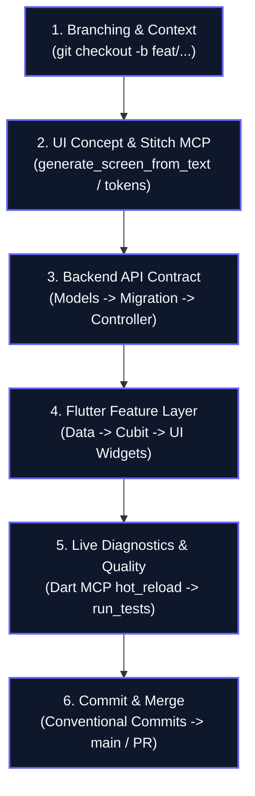

# Feature Development Workflow

This skill guides the implementation of any full-stack or frontend/backend feature in the **ProjectHub** monorepo, orchestrating **Git branching**, **Stitch MCP UI design**, **.NET 10 API backend**, and **Flutter & Dart MCP tooling**.

---

## 🔁 5-Stage Development Lifecycle



---

## 📌 Stage 1: Branching & Requirement Alignment

1. **Check Working Tree & Branch:**
   ```powershell
   git status
   git checkout -b feat/<feature-name>
   ```
2. **Review Specifications:**
   - Read relevant requirements in [`docs/prd.md`](file:///d:/MyProgrammingProjects/DotnetProjects/ProjectHub.Api/docs/prd.md) and [`docs/api-reference.md`](file:///d:/MyProgrammingProjects/DotnetProjects/ProjectHub.Api/docs/api-reference.md).
   - Check architectural constraints in [`docs/architecture-log.md`](file:///d:/MyProgrammingProjects/DotnetProjects/ProjectHub.Api/docs/architecture-log.md).

---

## 🎨 Stage 2: UI Design & Token Mapping (Stitch MCP)

When creating or modifying visual interfaces, leverage **Stitch MCP**:

1. **Generate or Inspect Screen Layouts:**
   - Use `generate_screen_from_text` on Stitch MCP for initial layout hierarchy and component ideation.
   - Or retrieve existing screen mockups with `get_screen`.
2. **Map Design Tokens to ProjectHub Stitch Theme:**
   - Always map colors and typography to [`lib/core/theme/`](file:///d:/MyProgrammingProjects/DotnetProjects/ProjectHub.Api/client/lib/core/theme/):
     - Background: `AppColors.background` (`#0F172A`)
     - Surface: `AppColors.surface` (`#13131B`) / Container (`#1E293B`)
     - Brand Primary: `AppColors.primary` (`#6366F1`)
     - Secondary: `AppColors.secondary` (`#38BDF8`)
     - Typography: Bundled **Inter** font family.
3. *Detailed guide:* Read [`references/stitch_workflow.md`](./references/stitch_workflow.md).

---

## ⚙️ Stage 3: Backend Implementation (.NET 10 Web API)

*(Skip if feature is frontend-only)*

1. **Entity & Data Model:**
   - Add/modify domain entities in `server/ProjectHub.Api/Models/`.
   - Update `AppDbContext.cs` relationships and configure enums as strings.
2. **EF Core Database Migration:**
   ```powershell
   cd server/ProjectHub.Api
   dotnet ef migrations add <AddFeatureName>
   dotnet ef database update
   ```
3. **DTOs, Validation & Services:**
   - Create request/response DTOs in `DTOs/<FeatureDtos>/`.
   - Add FluentValidation rules and AutoMapper profiles.
   - Implement business logic in `Services/<Feature>Service.cs` with role checks (`WorkspaceMember.Role == "Owner"`).
4. **Controllers & Endpoints:**
   - Expose thin endpoints with `[Authorize]` and `[ApiController]`.
   - Test endpoints with Swagger (`http://localhost:5259/swagger`) or `ProjectHub.Api.http`.
5. *Detailed guide:* Read [`references/backend_contract.md`](./references/backend_contract.md).

---

## 📱 Stage 4: Frontend Implementation (Flutter & Dart MCP)

1. **Feature Directory Structure (`client/lib/features/<feature>/`):**
   ```text
   features/<feature>/
   ├── data/
   │   ├── models/             # Freezed data models with fromJson
   │   └── datasources/        # RemoteDataSource (Dio) & Repository implementation
   ├── cubit/
   │   ├── <feature>_cubit.dart # Cubit with @injectable
   │   └── <feature>_state.dart # Freezed union states
   └── ui/
       ├── <feature>_screen.dart # Responsive screen (Mobile vs Desktop)
       └── widgets/             # Feature-specific private widgets
   ```
2. **Run Code Generation:**
   ```powershell
   cd client
   dart run build_runner build --delete-conflicting-outputs
   ```
3. **Register Dependencies:**
   - Annotate repositories with `@LazySingleton(as: I<Feature>Repository)`.
   - Annotate Cubits with `@injectable`.
4. **Apply Role Guards:**
   - Wrap privileged actions with `PermissionChecker.canManageWorkspace(role)`, `canEditProject()`, or `canEditTask()`.

---

## 🔬 Stage 5: Live Iteration, Diagnostics & Quality Gates

Leverage the **Dart MCP Server** and verification tools during coding:

1. **Live Debugging & Hot Reload:**
   - Check running apps with `list_running_apps`.
   - Trigger `hot_reload` or `hot_restart` via Dart MCP after UI adjustments.
   - Check for exceptions with `get_runtime_errors`.
   - Inspect widget hierarchies with `get_widget_tree` and `get_selected_widget`.
2. **Code Quality & Formatting:**
   - Format Dart code: call `dart_format` tool or run `dart format .`.
   - Run static analysis: call `analyze_files` or run `flutter analyze`.
   - Apply mechanical lint fixes: call `dart_fix`.
3. **Automated Testing:**
   - Run tests via Dart MCP `run_tests` or execute `flutter test`.
   - Run backend build verification: `dotnet build server/ProjectHub.Api.sln`.
4. **Automated Verification Script:**
   ```powershell
   .\.agents\skills\feature-development-workflow\scripts\verify_feature.ps1
   ```
5. *Detailed guide:* Read [`references/dart_mcp_guide.md`](./references/dart_mcp_guide.md).

---

## 🚀 Stage 6: Conventional Commit & Merge

1. **Format Commit Message:**
   Follow instructions in [`.github/.copilot/copilot-commit-message-instructions.md`](file:///d:/MyProgrammingProjects/DotnetProjects/ProjectHub.Api/.github/.copilot/copilot-commit-message-instructions.md):
   ```powershell
   git add .
   git commit -m "feat(<scope>): <concise description>`n`n- <Technical details>`n- <Architecture impact>`n`n<Business value sentence>."
   ```
2. **Merge or Open PR:**
   - **Local merge to main:**
     ```powershell
     git checkout main
     git merge feat/<feature-name>
     git branch -d feat/<feature-name>
     ```
   - **Or create GitHub PR via GitHub MCP:**
     Call `create_pull_request` tool when sharing with reviewers or publishing releases.

