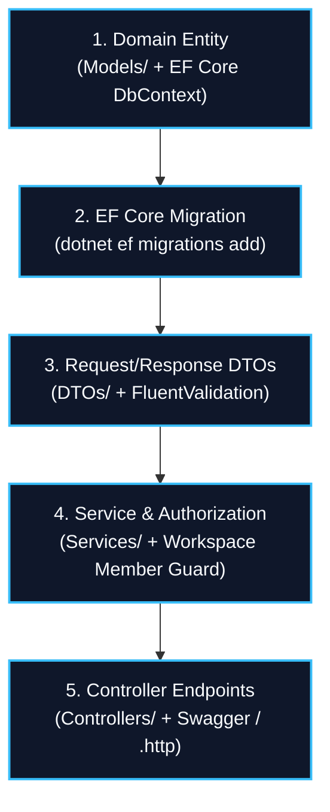

# .NET 10 Web API Backend Standards & Contract Guide

This guide details the conventions and implementation sequence for backend features in **ProjectHub.Api**.

---

## 🏛 Backend Implementation Flow



---

## 🔒 Key Authorization Invariants

1. **Workspace Boundary:** Always verify workspace membership before returning or mutating resources:
   ```csharp
   var isMember = await _context.WorkspaceMembers
       .AnyAsync(wm => wm.WorkspaceId == workspaceId && wm.UserId == userId);
   if (!isMember)
       throw new ForbiddenException("User is not a member of this workspace.");
   ```
2. **Owner Actions:** Restrict destructive operations (editing workspace, deleting workspace, adding/removing members) to `Role == "Owner"`:
   ```csharp
   var isOwner = await _context.WorkspaceMembers
       .AnyAsync(wm => wm.WorkspaceId == workspaceId && wm.UserId == userId && wm.Role == WorkspaceRoles.Owner);
   if (!isOwner)
       throw new ForbiddenException("Only workspace owners can perform this action.");
   ```
3. **Task Status & Assignee PATCH Endpoints:** Keep Kanban column moves light:
   - Use `PATCH /tasks/{id}/status` with `UpdateTaskStatusDto`.
   - Use `PATCH /tasks/{id}/assignee` with `UpdateTaskAssigneeDto`.

---

## 🧪 Verification via CLI & Swagger

- Run API locally: `dotnet watch run` in `server/ProjectHub.Api/`.
- Test endpoints interactively via Swagger at `http://localhost:5259/swagger`.
- Or execute requests using `server/ProjectHub.Api/ProjectHub.Api.http`.

