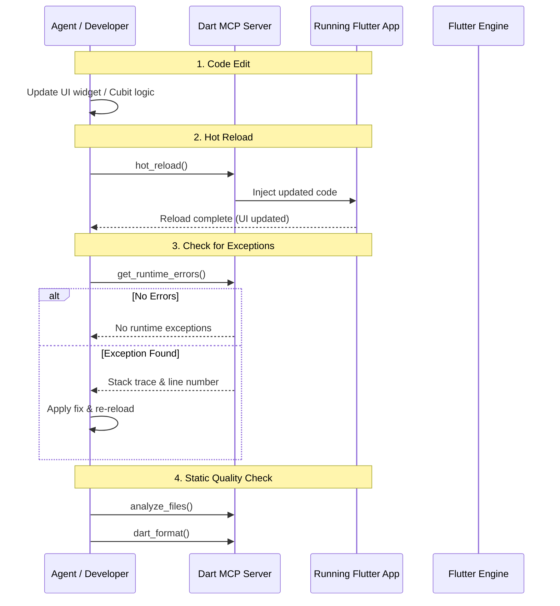

# Dart & Flutter MCP Server Tooling Guide

This guide details how to use **Dart MCP Server** tools for live iteration, diagnostics, static analysis, code fixing, and automated testing during Flutter development.

---

## 🛠 Available Dart MCP Tools

| Tool | Purpose | When to Use |
| :--- | :--- | :--- |
| `list_running_apps` | Lists active Flutter debugging sessions | Verifying if the app is currently running in emulator/browser |
| `hot_reload` | Triggers sub-second hot reload | After making UI or widget changes |
| `hot_restart` | Restarts the Flutter app state | After updating models, DI registrations, or top-level state |
| `get_runtime_errors` | Fetches active stack traces & exceptions | When diagnosing unexpected UI breaks or unhandled errors |
| `get_widget_tree` | Retrieves the runtime widget hierarchy | Inspecting widget nesting, constraints, or layout issues |
| `get_selected_widget` | Inspects details of a selected widget | Checking sizing, state, and properties of a specific element |
| `analyze_files` | Runs Dart static analysis | Checking for compiler warnings, unused imports, or lint errors |
| `dart_format` | Formats Dart source files | Standardizing code formatting before committing |
| `dart_fix` | Applies automatic mechanical lint fixes | Fixing deprecated APIs, const constructors, etc. |
| `run_tests` | Executes unit and widget tests | Verifying feature correctness before merge |

---

## 🔄 Live Development Cycle



---

## 📋 Code Generation Checklist

Whenever you modify `@freezed` models, `@JsonSerializable` classes, or `@injectable` registrations:

```powershell
cd client
dart run build_runner build --delete-conflicting-outputs
```

Then trigger `hot_restart` via Dart MCP to reload the generated DI container and JSON serializers.

