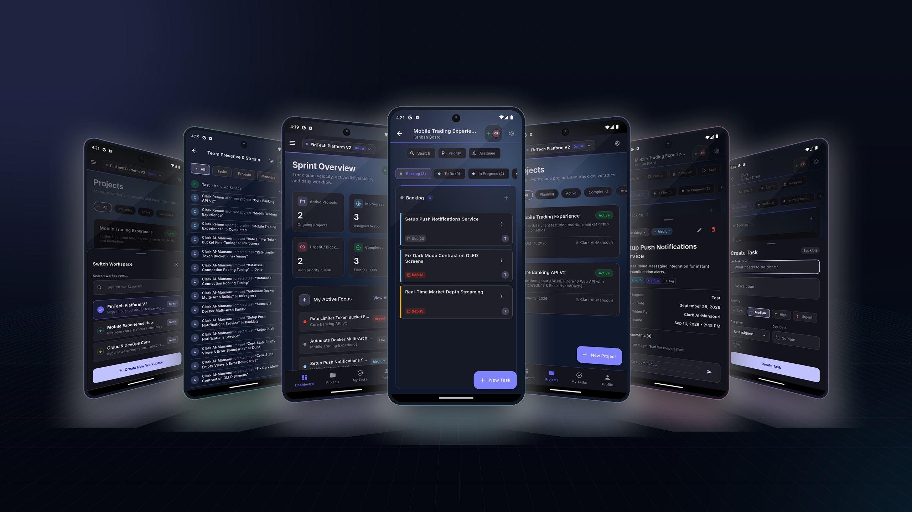
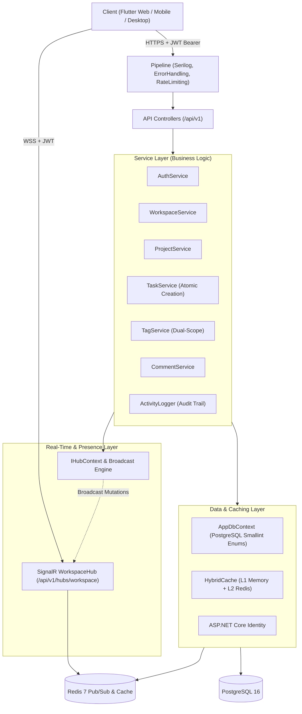
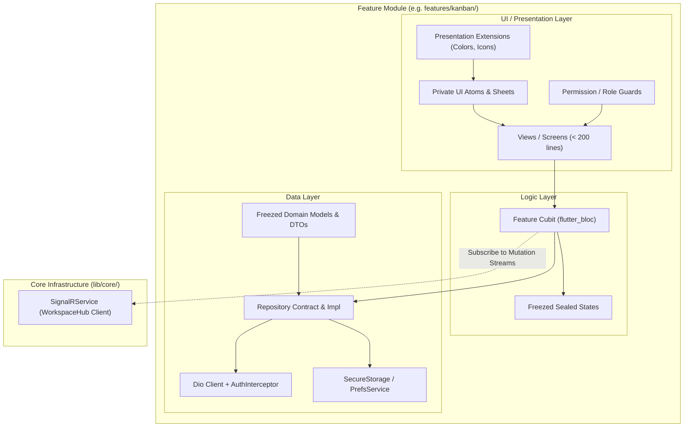

# ProjectHub — Polyglot Monorepo

<div align="center">



<br />
<br />

[](https://dotnet.microsoft.com/)
[](https://learn.microsoft.com/dotnet/csharp/)
[](https://flutter.dev/)
[](https://dart.dev/)
[](https://www.postgresql.org/)
[](https://redis.io/)
[](https://www.docker.com/)
[]()
[](./LICENSE)

**An enterprise-grade, full-stack collaborative project and task management platform.**  
Featuring high-throughput **ASP.NET Core 10 Web API**, real-time **SignalR** synchronization with distributed **Redis 7** pub/sub, **HybridCache** resilient caching, **PostgreSQL 16**, and a responsive **Flutter 3** client engineered with **BLoC/Cubit**, **Material 3**, and the **Stitch Deep Slate** design system.

[Explore Features](#-key-features) • [System Architecture](#-system-architecture) • [ADR Catalog](#-architectural-decision-records-adrs) • [API Reference](#-api-specification) • [Local Setup](#-getting-started)

</div>

---

## 🌟 Executive Overview

**ProjectHub** is engineered to solve real-world collaboration challenges for distributed engineering and product teams. It organizes workflows into secure **Workspaces**, tracks scoped initiatives across their lifecycle as **Projects**, and powers day-to-day execution via visual **Kanban Boards**, flat chronological **Task Comments**, categorical **Dual-Scope Tags**, live **Online Presence**, and a personalized **My Tasks** aggregation view.

Designed from the ground up as a **Polyglot Monorepo**, ProjectHub couples a high-performance, strongly-typed .NET 10 backend with a unified, cross-platform Flutter client targeting Mobile (Android/iOS), Desktop (Windows/macOS), and Web.

---

## ✨ Key Features

### 🏢 Multi-Tenant Workspaces & Access Control
- **Strict Boundary Isolation:** Workspaces act as top-level organizational and security boundaries containing all projects, tasks, and members.
- **Single Source of Truth RBAC:** Role assignments (`Owner` or `Member`) governed strictly via workspace memberships ([ADR-0003](docs/adr/0003-workspace-owner-single-source-of-truth.md)).
- **Dynamic Member Role Management:** Workspace owners can promote or demote members (`PUT /api/v1/workspaces/{id}/members/{userId}/role`) with immediate compound tag cache invalidation ([ADR-0018](docs/adr/0018-enum-schema-migration-and-resilient-caching.md)).
- **Graceful Lifecycle Departure:** Removing a workspace member automatically unassigns their active tasks across all projects, preventing orphan state ([ADR-0006](docs/adr/0006-automatic-task-unassignment-on-member-removal.md)).
- **Workspace Wayfinding:** Owners configure one of 10 vetted **Accent Colors** (`teal`, `blue`, `indigo`, `purple`, `pink`, `rose`, `amber`, `emerald`, `cyan`, `violet`) as an instant visual waypoint across switchers and sidebars without breaking core semantic tokens ([ADR-0015](docs/adr/0015-workspace-accent-color-replaces-personal-palette.md)).

### ⚡ Real-Time Collaboration & Online Presence (SignalR)
- **Bidirectional Push Synchronization:** Built on ASP.NET Core SignalR (`WorkspaceHub` at `/api/v1/hubs/workspace`) backed by Redis pub/sub backplane for instantaneous cross-client updates ([ADR-0017](docs/adr/0017-signalr-realtime-collaboration-and-dual-scope-tags.md)).
- **Tier 1 & Tier 2 Mutation Broadcasts:** Real-time push for task lifecycle events (`TaskCreated`, `TaskStatusChanged`, `TaskAssigned`, `TaskDeleted`) and collaboration events (`CommentAdded`, `CommentDeleted`).
- **Distributed Presence Tracking:** Live online presence tracked via Redis Sets (`workspace:{id}:online_users`) and surfaced as an animated avatar stack in workspace headers and Kanban app bars with auto-disconnect timeouts.

### 🏷 Categorical Dual-Scope Tags & Task Discussions
- **Dual-Scope Tag Model:** Tags partitioned into reusable workspace-level tags (cross-project) and scoped project-level tags with deterministic 12-palette color hashing guaranteeing high contrast across light and dark themes ([ADR-0017](docs/adr/0017-signalr-realtime-collaboration-and-dual-scope-tags.md)).
- **Kanban Tag Filtering:** Multi-tag real-time filtering with responsive filter chips in Kanban column headers.
- **Atomic Task Creation:** Supports upfront tag assignment during task creation (`tagIds`), validating tag ownership strictly before database commitment ([ADR-0018](docs/adr/0018-enum-schema-migration-and-resilient-caching.md)).
- **Flat Chronological Comments:** Single-level discussion threads attached to tasks with live counter badges on Kanban cards.

### 📋 Interactive 5-Stage Kanban Engine
- **Visual Workflow Columns:** Tasks progress through fixed, industry-standard stages: `Backlog` $\rightarrow$ `Todo` $\rightarrow$ `InProgress` $\rightarrow$ `Review` $\rightarrow$ `Done`.
- **Granular PATCH Operations:** High-performance dedicated PATCH endpoints for status movements (`PATCH /api/v1/tasks/{id}/status`) and reassignments (`PATCH /api/v1/tasks/{id}/assignee`) rather than heavy full-body PUTs ([ADR-0004](docs/adr/0004-dedicated-patch-endpoints-for-kanban-status-and-assignee.md)).
- **Real-Time Drag & Drop:** Fluid mobile touch gestures and desktop drag-and-drop task card relocation with optimistic UI updates.
- **Multi-Dimensional Filtering:** Real-time search, priority filtering (`Urgent`, `High`, `Medium`, `Low`), assignee filtering, and tag filtering.
- **Responsive Skeletons:** Dual-theme loading skeletons adapted for seamless flicker-free loading in both Dark and Light modes.

### 🎯 Workspace-Scoped "My Tasks" & Activity Streams
- **Urgency Aggregation:** Cross-project dashboard consolidating all tasks assigned to the active user within the workspace ([ADR-0008](docs/adr/0008-workspace-scoped-my-tasks-aggregation.md)).
- **Categorized Queues:** Intelligently grouped by priority tiers and due dates (`Overdue`, `Due Today`, `Upcoming`).
- **Dedicated Activity Stream:** Dedicated full activity stream route (`/activity-stream`) complementing the dashboard summary card.

### 🔒 Enterprise-Grade Security & Auth
- **Multi-Session SHA-256 Token Rotation:** Refresh tokens hashed using SHA-256 with rotation and automatic reuse-detection that instantly revokes compromised session families ([ADR-0005](docs/adr/0005-multi-session-sha256-refresh-token-rotation.md)).
- **Two-Tier Rate Limiting:** Global sliding window (100 req/min per IP) paired with strict partitioned fixed windows on sensitive authentication endpoints (Login: 5/min, Register: 3/min, Password Reset: 2/min) to prevent brute-force attacks ([ADR-0013](docs/adr/0013-two-tier-rate-limiting.md)).
- **External OAuth Integration:** Native client token exchange with identity providers (Google & GitHub) backed by server-side verification ([ADR-0012](docs/adr/0012-native-client-external-oauth-integration.md)).

### 🗄 High-Efficiency Database Enums & Resilient Caching
- **PostgreSQL Smallint Enum Migration:** `Task.Status` and `Task.Priority` stored as PostgreSQL `smallint` (2 bytes) via EF Core value conversion with composite indexing on `(ProjectId, Status)`, reducing index storage by >80% while preserving backward-compatible JSON string contracts over HTTP ([ADR-0018](docs/adr/0018-enum-schema-migration-and-resilient-caching.md)).
- **Startup Tolerance & L1 Fallback:** Non-blocking asynchronous Redis connection (`AbortOnConnectFail = false`) allowing API boot and full traffic serving via L1 in-memory fallback during Redis downtime ([ADR-0018](docs/adr/0018-enum-schema-migration-and-resilient-caching.md)).
- **Observable Diagnostic Health:** Live health endpoint (`/api/v1/health`) distinguishing `Healthy`, `Degraded` (PostgreSQL up, Redis down), and `Unhealthy` (PostgreSQL down) states.

### 🎨 Stitch Deep Slate Design System & Clean Architecture
- **Dual Theme Support:** Material 3 implementation with a cyberpunk-inspired Deep Slate dark mode canvas (`#0F172A`), luminous Electric Violet (`#C0C1FF`) and Sky Blue (`#89CEFF`) brand accents, accompanied by a calibrated light mode counterpart.
- **Strict Clean Architecture (<200 lines/file):** Presentation (UI + Cubits) and Data (Repositories + Models) layers with zero domain pass-through overhead, strictly decoupled UI extensions, and route-scoped DI ([ADR-0016](docs/adr/0016-strict-clean-architecture-without-domain-layer.md)).
- **Ambient Glow Shaders:** Custom background canvas glow shaders rendering depth-aware radial gradients.
- **Internationalization (i18n):** Complete native English (`en`) and Arabic (`ar`) RTL support with localized dialogs, sheets, and layout flipping.

---

## 🏗 System Architecture

### Monorepo Structure

```
ProjectHub/
├── .github/
│   └── workflows/
│       ├── server.yml              # CI pipeline for .NET backend
│       └── client.yml              # CI pipeline for Flutter client
├── docs/                           # Living Architecture Documentation
│   ├── adr/                        # 18 Architectural Decision Records (ADRs)
│   ├── backend-architecture.md     # .NET 10 service layers, SignalR, caching, pipeline
│   ├── frontend-architecture.md    # Flutter Clean Architecture (No Domain), Cubits, Repos
│   ├── design-system.md            # Stitch tokens, typography, colors
│   ├── api-reference.md            # Complete REST & SignalR contracts
│   └── user-flow.md                # Navigation maps, user journeys & responsive states
├── scripts/
│   ├── build-all.ps1               # Full-stack compile & verification
│   └── run-dev.ps1                 # Dev script launching backend watch + client
├── server/                         # ASP.NET Core 10 Web API
│   ├── ProjectHub.Api/
│   │   ├── Controllers/            # Versioned API endpoints (Auth, Workspaces, Tags, Comments, Tasks)
│   │   ├── Hubs/                   # SignalR WorkspaceHub (/api/v1/hubs/workspace)
│   │   ├── Services/               # Domain business logic, tag validation & activity logging
│   │   ├── Data/                   # AppDbContext (EF Core 10, smallint enums) & Migrations
│   │   ├── Models/                 # Domain entities (Workspace, Project, Task, Comment, Tag)
│   │   ├── DTOs/                   # Request/response contracts with FluentValidation
│   │   └── Middleware/             # Global error handler & two-tier rate limiter
│   └── ProjectHub.Api.sln
└── client/                         # Flutter Client (Android, iOS, Web, Desktop)
    ├── lib/
    │   ├── core/                   # Network (Dio), Realtime (SignalRService), Storage, Theming, DI
    │   ├── features/               # Feature-First Modules (<200 lines/file: Auth, Workspaces, Projects, Kanban, Tasks)
    │   ├── l10n/                   # ARB localization files (English & Arabic RTL)
    │   ├── app.dart                # App routing & theme container
    │   └── main.dart               # Startup sequence & dependency bootstrapping
    └── pubspec.yaml
```

### Backend Architecture (.NET 10)



### Frontend Architecture (Flutter)



---

## 🛠 Technology Stack Matrix

| Layer | Technologies & Libraries | Key Responsibilities |
| :--- | :--- | :--- |
| **Backend Framework** | **.NET 10.0 (C# 13)** | High-throughput async REST API, minimal overhead, GC optimizations |
| **Real-Time Engine** | **ASP.NET Core SignalR**, **StackExchange.Redis Backplane** | Bidirectional push synchronization for tasks/comments, distributed presence sets |
| **ORM & Database** | **Entity Framework Core 10**, **Npgsql**, **PostgreSQL 16** | Code-first migrations, composite indexing, smallint enums, cascade rules |
| **Caching Tier** | **Microsoft.Extensions.Caching.Hybrid**, **StackExchange.Redis** | Two-tier L1 memory + L2 Redis caching with stampede prevention & L1 fallback |
| **Identity & Security** | **ASP.NET Core Identity**, **JWT Bearer**, **SHA-256 Rotation** | Multi-session token rotation, revocation list, Bcrypt password hashing |
| **Resilience & Protection** | **System.Threading.RateLimiting** | Two-tier sliding/fixed window rate limiters |
| **Validation & Mapping** | **FluentValidation 11**, **AutoMapper 12** | Automatic request DTO validation, entity-to-DTO mapping |
| **Logging & Telemetry** | **Serilog**, **Async File Sink**, **Console Sink** | Structured JSON logging with trace ID correlation |
| **Frontend Framework** | **Flutter 3.29+**, **Dart 3.11+** | Cross-platform UI compilation (Android, iOS, Web, Desktop) |
| **State Management** | **flutter_bloc 9.1** (`Cubit`) | Predictable, testable unidirectional state flows |
| **Dependency Injection** | **get_it 8.0**, **injectable 2.5** | Compile-time service locator and inversion of control |
| **Networking** | **Dio 5.8**, Custom `AuthInterceptor` | Token auto-refresh on 401, global error transformation, retries |
| **Data Immutability** | **Freezed 3.0**, **json_serializable 6.9** | Sealed union state models, immutable copyWith, JSON serialization |
| **Security & Storage** | **flutter_secure_storage 9.2**, **shared_preferences 2.5** | Encrypted token storage (KeyStore/KeyChain), preferences persistence |
| **Design & Animation** | **Material 3**, **flutter_animate 4.5**, **skeletonizer 2.1** | Custom Design Tokens, shimmer skeletons, smooth micro-interactions |

---

## 📖 Architectural Decision Records (ADRs)

ProjectHub enforces technical rigor via 18 formal Architecture Decision Records located in [`docs/adr/`](docs/adr/):

| ADR | Title | Decision & Architectural Impact |
| :--- | :--- | :--- |
| **[ADR-0001](docs/adr/0001-implicit-workspace-membership-for-projects.md)** | Implicit Workspace Membership for Projects | Project membership is open to all workspace members, eliminating redundant project-level ACL tables. |
| **[ADR-0002](docs/adr/0002-strict-read-only-freeze-on-archived-projects.md)** | Strict Read-Only Freeze on Archived Projects | Archived projects freeze all contained tasks as read-only, preventing post-archive modifications. |
| **[ADR-0003](docs/adr/0003-workspace-owner-single-source-of-truth.md)** | Workspace Owner Single Source of Truth | Workspace ownership is derived solely from the `WorkspaceMembers` join table with `Role = Owner`. |
| **[ADR-0004](docs/adr/0004-dedicated-patch-endpoints-for-kanban-status-and-assignee.md)** | Dedicated PATCH Endpoints for Kanban | Granular `PATCH` routes for status and assignee avoid full-entity replacement collisions on Kanban movements. |
| **[ADR-0005](docs/adr/0005-multi-session-sha256-refresh-token-rotation.md)** | Multi-Session SHA256 Refresh Token Rotation | Multi-device session support with hashed token storage and automatic session termination on token reuse. |
| **[ADR-0006](docs/adr/0006-automatic-task-unassignment-on-member-removal.md)** | Automatic Task Unassignment on Member Removal | Removing a member clears assignee references across all tasks in that workspace. |
| **[ADR-0007](docs/adr/0007-responsive-kanban-navigation-and-modal-interactions.md)** | Responsive Kanban Navigation & Modals | Full-screen column views on mobile vs. multi-column layouts on desktop; bottom sheets on mobile vs. dialogs on desktop. |
| **[ADR-0008](docs/adr/0008-workspace-scoped-my-tasks-aggregation.md)** | Workspace-Scoped My Tasks Aggregation | My Tasks strictly aggregates tasks within the currently active workspace to preserve multi-tenant context. |
| **[ADR-0009](docs/adr/0009-interim-focus-refresh-synchronization-prior-to-signalr.md)** | Interim Focus Refresh Synchronization | Optimistic UI mutations paired with AppLifecycle / focus refresh before full SignalR integration. |
| **[ADR-0010](docs/adr/0010-url-segment-api-versioning.md)** | URL Segment API Versioning | All REST endpoints are prefixed with `/api/v1` for clear, non-breaking contract evolution. |
| **[ADR-0011](docs/adr/0011-activity-event-audit-trail-and-logger.md)** | Activity Event Audit Trail & Logger | Centralized audit logging capturing actor, event type, entity IDs, and timestamp metadata. |
| **[ADR-0012](docs/adr/0012-native-client-external-oauth-integration.md)** | Native Client External OAuth Integration | Native SDK token exchange with backend token validation (Google & GitHub). |
| **[ADR-0013](docs/adr/0013-two-tier-rate-limiting.md)** | Two-Tier Rate Limiting | Global IP sliding window (100 req/min) combined with tight fixed windows on sensitive auth endpoints. |
| **[ADR-0014](docs/adr/0014-unified-profile-settings-and-dynamic-theming.md)** | Unified Profile Settings & Dynamic Theming | Single profile view managing user details, theme switching (Light/Dark), and language selection. |
| **[ADR-0015](docs/adr/0015-workspace-accent-color-replaces-personal-palette.md)** | Workspace Accent Color Replaces Personal Palette | Workspace-level curated 10-accent palette used exclusively as a wayfinding signal without polluting UI semantics. |
| **[ADR-0016](docs/adr/0016-strict-clean-architecture-without-domain-layer.md)** | Strict Clean Architecture Without Domain Layer | Flutter client adopts strict 2-layer Presentation & Data architecture (<200 lines/file, route-scoped DI, dumb widgets). |
| **[ADR-0017](docs/adr/0017-signalr-realtime-collaboration-and-dual-scope-tags.md)** | SignalR Real-Time Collaboration & Dual-Scope Tags | ASP.NET Core SignalR push synchronization, Redis online presence sets, chronological task comments, and dual-scope tags. |
| **[ADR-0018](docs/adr/0018-enum-schema-migration-and-resilient-caching.md)** | Enum Schema Migration, Atomic Task Creation & Resilient Caching | PostgreSQL `smallint` status/priority enums with composite indexing, atomic tag attachment, and non-blocking Redis L1 fallback. |

---

## 📡 API Specification

All endpoints are versioned under `/api/v1` and return standardized JSON envelopes.

### Authentication & Identity (`/api/v1/auth`)
| Method | Endpoint | Description | Auth Required |
| :--- | :--- | :--- | :---: |
| `POST` | `/api/v1/auth/register` | Register new user account | No |
| `POST` | `/api/v1/auth/login` | Authenticate with credentials, returns Access + Refresh token | No |
| `POST` | `/api/v1/auth/refresh` | Rotate refresh token and issue new JWT | No |
| `POST` | `/api/v1/auth/logout` | Revoke current session refresh token | Yes |
| `POST` | `/api/v1/auth/forgot-password` | Request password reset token | No |
| `POST` | `/api/v1/auth/reset-password` | Complete password reset using token | No |
| `POST` | `/api/v1/auth/external-login` | Authenticate via external OAuth provider token | No |

### Workspaces (`/api/v1/workspaces`)
| Method | Endpoint | Description | Auth Required |
| :--- | :--- | :--- | :---: |
| `GET` | `/api/v1/workspaces` | List all workspaces where user is a member | Yes |
| `POST` | `/api/v1/workspaces` | Create a new workspace (creator becomes `Owner`) | Yes |
| `GET` | `/api/v1/workspaces/{id}` | Get workspace details and settings | Yes |
| `PUT` | `/api/v1/workspaces/{id}` | Update workspace name, description, or accent color | Yes (Owner) |
| `DELETE` | `/api/v1/workspaces/{id}` | Delete workspace and all contained assets | Yes (Owner) |
| `GET` | `/api/v1/workspaces/{id}/members` | List members and their assigned roles | Yes |
| `POST` | `/api/v1/workspaces/{id}/members` | Add user to workspace as `Member` or `Owner` | Yes (Owner) |
| `PUT` | `/api/v1/workspaces/{id}/members/{userId}/role` | Update member role (`Owner` or `Member`) | Yes (Owner) |
| `DELETE` | `/api/v1/workspaces/{id}/members/{userId}` | Remove member (triggers task unassignment) | Yes (Owner) |
| `GET` | `/api/v1/workspaces/{id}/projects` | List projects in workspace | Yes |
| `GET` | `/api/v1/workspaces/{id}/my-tasks` | Aggregated personal task list in active workspace | Yes |
| `GET` | `/api/v1/workspaces/{id}/activity` | Fetch workspace-wide activity audit trail | Yes |

### Dual-Scope Tags (`/api/v1/workspaces` & `/api/v1/projects` & `/api/v1/tasks`)
| Method | Endpoint | Description | Auth Required |
| :--- | :--- | :--- | :---: |
| `GET` | `/api/v1/workspaces/{id}/tags` | List reusable workspace-level tags | Yes |
| `POST` | `/api/v1/workspaces/{id}/tags` | Create workspace-wide tag | Yes (Owner) |
| `GET` | `/api/v1/projects/{id}/available-tags` | List all tags applicable to project (workspace + project scoped) | Yes |
| `POST` | `/api/v1/projects/{id}/tags` | Create project-scoped tag | Yes (Owner/Creator) |
| `DELETE` | `/api/v1/tags/{id}` | Delete tag (cascades from tasks without deleting tasks) | Yes (Owner/Creator) |
| `POST` | `/api/v1/tasks/{id}/tags` | Attach existing tag to task (max 5 tags per task) | Yes |
| `DELETE` | `/api/v1/tasks/{id}/tags/{tagId}` | Detach tag from task | Yes |

### Task Comments (`/api/v1/tasks` & `/api/v1/comments`)
| Method | Endpoint | Description | Auth Required |
| :--- | :--- | :--- | :---: |
| `GET` | `/api/v1/tasks/{id}/comments` | List flat chronological comments on task | Yes |
| `POST` | `/api/v1/tasks/{id}/comments` | Add comment to task | Yes |
| `PUT` | `/api/v1/comments/{id}` | Edit comment content | Yes (Author) |
| `DELETE` | `/api/v1/comments/{id}` | Delete comment | Yes (Author/Owner) |

### Projects (`/api/v1/projects`)
| Method | Endpoint | Description | Auth Required |
| :--- | :--- | :--- | :---: |
| `GET` | `/api/v1/projects/{id}` | Get project details, metrics, and lifecycle status | Yes |
| `PUT` | `/api/v1/projects/{id}` | Update project metadata or status | Yes (Owner/Creator) |
| `DELETE` | `/api/v1/projects/{id}` | Delete project and cascade tasks | Yes (Owner/Creator) |
| `GET` | `/api/v1/projects/{id}/tasks` | Get all tasks belonging to the project | Yes |
| `POST` | `/api/v1/projects/{id}/tasks` | Create task within project (supports optional `tagIds`) | Yes |
| `GET` | `/api/v1/projects/{id}/activity` | Project-scoped activity audit trail | Yes |

### Tasks (`/api/v1/tasks`)
| Method | Endpoint | Description | Auth Required |
| :--- | :--- | :--- | :---: |
| `GET` | `/api/v1/tasks/{id}` | Get task details | Yes |
| `PUT` | `/api/v1/tasks/{id}` | Update task title, description, priority, due date | Yes |
| `PATCH` | `/api/v1/tasks/{id}/status` | Fast status transition (Kanban movement) | Yes |
| `PATCH` | `/api/v1/tasks/{id}/assignee` | Reassign task to workspace member or unassign | Yes |
| `DELETE` | `/api/v1/tasks/{id}` | Delete task | Yes (Owner/Creator) |

### Real-Time Synchronization Hub (`/api/v1/hubs/workspace`)
| Transport | Hub Route | Protocol & Payload Contracts | Auth Required |
| :--- | :--- | :--- | :---: |
| `WebSockets` / `SSE` | `/api/v1/hubs/workspace` | Group join/leave (`JoinWorkspace`, `LeaveWorkspace`) and real-time broadcasts (`PresenceChanged`, `TaskCreated`, `TaskStatusChanged`, `TaskAssigned`, `TaskDeleted`, `CommentAdded`, `CommentDeleted`) | Bearer (`?access_token=...`) |

### System & Diagnostics (`/api/v1/health`)
| Method | Endpoint | Description | Auth Required |
| :--- | :--- | :--- | :---: |
| `GET` | `/api/v1/health` | Live diagnostic health: reports `Healthy` (200), `Degraded` with L1 fallback (200), or `Unhealthy` (503) | No |

---

## 🚀 Getting Started

### Prerequisites
- [.NET 10 SDK](https://dotnet.microsoft.com/download)
- [Flutter SDK 3.29+](https://flutter.dev/docs/get-started/install) (stable channel)
- [Docker Desktop](https://www.docker.com/products/docker-desktop/) (must be running for automated container provisioning)
- [Visual Studio Code](https://code.visualstudio.com/) with C# Dev Kit & Flutter extensions

> [!TIP]
> **Zero Manual Docker Setup:** You do **not** need to manually create or start PostgreSQL or Redis containers. When you launch via VS Code (`F5`) or execute `.\scripts\run-dev.ps1`, the automated pre-launch pipeline detects your Docker daemon, auto-provisions missing containers, and starts them before the backend boots.

### 1. Clone the Repository

```bash
git clone https://github.com/Clark605/ProjectHub.Api.git
cd ProjectHub.Api
```

### 2. Configure Backend Secrets & Migrate Database

On a fresh clone, configure your local development secrets and initialize the database schema:

```bash
cd server/ProjectHub.Api

# Configure development user secrets
dotnet user-secrets set "ConnectionStrings:DefaultConnection" "Host=localhost;Port=5432;Database=ProjectHubDb;Username=postgres;Password=postgres;Pooling=true"
dotnet user-secrets set "Jwt:Key" "DEVELOPMENT_SECRET_KEY_FOR_LOCAL_RUNNING_MIN_32_BYTES_LONG!"

# Ensure containers are running (if not already started via VS Code)
powershell -ExecutionPolicy Bypass -File ../../scripts/start-docker-services.ps1

# Apply EF Core migrations to create the schema & tables
dotnet ef database update
```

### 3. Run Locally

#### Option A: VS Code Compound F5 Debugging (Recommended)
1. Open the repository root in VS Code.
2. Ensure **Docker Desktop** is running.
3. Navigate to **Run and Debug** (`Ctrl+Shift+D`).
4. Select **`Full Stack (Server + Client)`** and hit `F5`.
   - *The pre-launch task automatically ensures PostgreSQL (`5432`) and Redis (`6379`) containers are running, compiles the .NET server, and starts both server and client together.*

#### Option B: Quick Dev Script (PowerShell)
```powershell
# From repository root — automatically verifies Docker services and launches both apps
.\scripts\run-dev.ps1
```

#### Option C: Manual CLI
```bash
# Start Docker services
powershell -ExecutionPolicy Bypass -File .\scripts\start-docker-services.ps1
# (or ./scripts/start-docker-services.sh on macOS/Linux)

# Terminal 1: Backend API
cd server/ProjectHub.Api
dotnet watch run --urls "http://localhost:5259"

# Terminal 2: Flutter Client
cd client
flutter pub get
flutter run -d chrome       # For Web
# or
flutter run -d windows      # For Windows Desktop
# or
flutter run                 # For connected Mobile device / emulator
```

#### Stopping Infrastructure Services
When finished developing, gracefully stop the background containers:
```powershell
.\scripts\stop-docker-services.ps1
# (or ./scripts/stop-docker-services.sh on macOS/Linux)
```

- Swagger UI available at: `http://localhost:5259/swagger`
- API Health Check at: `http://localhost:5259/api/v1/health`

---

## 🧪 Testing & Code Verification

Both backend and frontend enforce strict code verification gates:

```bash
# Verify entire Monorepo
.\scripts\build-all.ps1

# Backend Compilation & Tests
dotnet build server/ProjectHub.Api.sln
dotnet test server/ProjectHub.Api.sln

# Client Static Analysis & Unit Tests
cd client
flutter analyze
flutter test
```

### CI/CD Pipelines
- **Server Workflow (`.github/workflows/server.yml`):** Runs on push/PR modifying `server/**`, restores dependencies, builds solution with `--no-restore`, and executes test suites.
- **Client Workflow (`.github/workflows/client.yml`):** Runs on push/PR modifying `client/**`, runs `flutter analyze` with strict lints, and executes widget and unit tests.

---

## 📄 License & Attribution

This project is licensed under the [MIT License](LICENSE).

Developed with passion by **Clark Remon** as an enterprise-grade polyglot portfolio system demonstrating modern cloud architecture, clean domain boundaries, and responsive mobile-first UI engineering.
