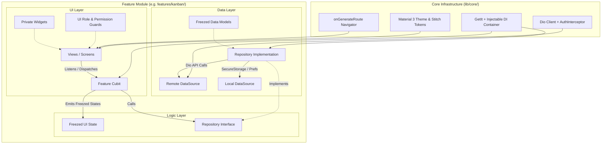
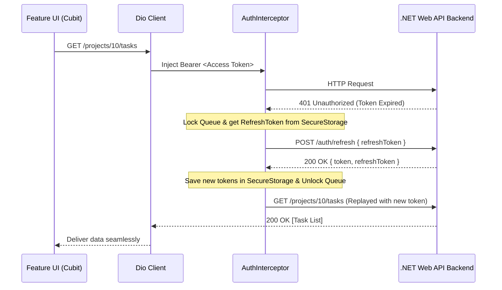
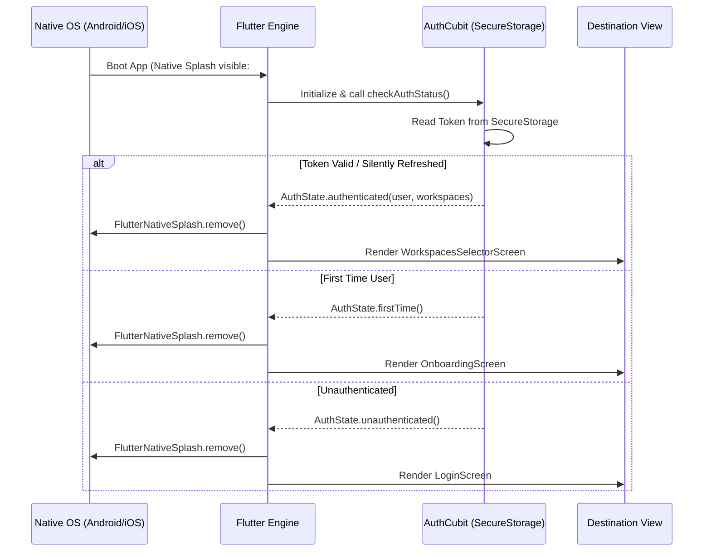

# ProjectHub Client — Flutter Frontend (Mobile & Web)

A modern, responsive cross-platform client application for **ProjectHub**, built with **Flutter 3**, **Dart**, **BLoC/Cubit**, **Freezed**, **Injectable (GetIt)**, **Dio**, and **Material 3** with custom Stitch UI design tokens.

---

## 📋 Table of Contents

- [Overview](#-overview)
- [Tech Stack & Key Packages](#-tech-stack--key-packages)
- [Architecture & Folder Structure](#-architecture--folder-structure)
- [Role-Based UI Authorization](#-role-based-ui-authorization)
- [State Management & Data Flow](#-state-management--data-flow)
- [Networking & Silent Token Refresh](#-networking--silent-token-refresh)
- [Design System & Theming](#-design-system--theming)
- [Responsive Layout Strategy](#-responsive-layout-strategy)
- [App Startup Flow](#-app-startup-flow)
- [Getting Started & Local Setup](#-getting-started--local-setup)
- [Code Generation & Build Commands](#-code-generation--build-commands)
- [Code Quality & Linting](#-code-quality--linting)

---

## 🌟 Overview

The **ProjectHub Client** delivers a responsive experience across Web and Mobile platforms (Android, iOS). It connects to the ASP.NET Core Web API backend to provide workspace management, project dashboards, and interactive Kanban boards with role-based UI guards.

---

## 🛠 Tech Stack & Key Packages

| Category | Package | Purpose |
| :--- | :--- | :--- |
| **Framework** | Flutter 3.x / Dart 3.x | Cross-platform UI toolkit (Web, Android, iOS) |
| **State Management** | `flutter_bloc` | Predictable, testable Cubits with sealed states |
| **Immutability & Unions**| `freezed`, `freezed_annotation` | Pattern-matching union states, copyWith, value equality |
| **Serialization** | `json_serializable`, `json_annotation` | Type-safe JSON converters generated via `build_runner` |
| **Dependency Injection** | `get_it`, `injectable` | Automated `@injectable` and `@lazySingleton` wiring |
| **Networking** | `dio` | HTTP client with retry policy, timeout configuration & interceptors |
| **Secure Storage** | `flutter_secure_storage` | Encrypted Keychain (iOS) & Keystore (Android) for JWT tokens |
| **Preferences** | `shared_preferences` | User preferences (active workspace, theme mode) |
| **Native Splash** | `flutter_native_splash` | Native zero-flicker splash screen (`#0F172A`) |
| **Animations** | `flutter_animate` | Staggered list animations, glowing effects, fade transitions |
| **Localization** | `flutter_localizations`, `intl` | Official Flutter `.arb` multi-language support (English & Arabic) |

---

## 🏗 Architecture & Folder Structure

The project employs a **Feature-First Layered Architecture** with the **Repository Pattern** and **Cubit** state management:



### Directory Layout

```text
client/
├── assets/
│   ├── fonts/                  # Bundled Inter font family (Regular, Medium, SemiBold, Bold)
│   ├── icons/                  # SVG and vector icons
│   └── images/                 # Onboarding & branding illustrations
├── l10n/
│   ├── app_en.arb              # English localization bundle
│   └── app_ar.arb              # Arabic localization bundle
├── lib/
│   ├── main.dart               # Entrypoint, native splash preserve & DI configuration
│   ├── app.dart                # MaterialApp with onGenerateRoute, AuthGate, theme & l10n
│   │
│   ├── core/                   # Shared cross-cutting modules
│   │   ├── constants/          # API endpoints, storage keys, app constants
│   │   ├── di/                 # GetIt + Injectable setup (injection.dart)
│   │   ├── errors/             # Custom AppExceptions, Failure classes & Dio mapper
│   │   ├── network/            # Dio client & AuthInterceptor (silent refresh queue)
│   │   ├── routes/             # AppRouter (onGenerateRoute), RouteNames, Transitions
│   │   ├── storage/            # FlutterSecureStorage & SharedPreferences helpers
│   │   ├── theme/              # Stitch color tokens, typography & ThemeData
│   │   ├── utils/              # PermissionChecker, date formatters, validators
│   │   └── widgets/            # Shared UI components (glass cards, buttons, chips, inputs)
│   │
│   └── features/               # Feature-First Modules
│       ├── splash/             # Native splash dismissal & initialization
│       ├── onboarding/         # Onboarding walkthrough & first-launch screen
│       ├── auth/               # Login, register, profile screens & AuthCubit
│       ├── workspaces/         # Workspace switcher, creation modal & member management
│       ├── projects/           # Projects dashboard, creation modal & ProjectCubit
│       └── kanban/             # Kanban board, column drag-drop, mobile swipe & task sheet
│
├── test/                       # Unit and widget tests
├── pubspec.yaml                # Dependencies & asset declarations
└── analysis_options.yaml       # Dart analysis & lint rules
```

---

## 🔒 Role-Based UI Authorization

The client uses strongly typed permission helpers (`core/utils/permission_checker.dart`) to conditionally render and guard action buttons (edit, delete, invite, remove) matching the backend security model:

| Resource | Action | Workspace `Owner` | Creator (`CreatedBy == userId`) | Assignee (`AssigneeId == userId`) | Regular `Member` |
| :--- | :--- | :---: | :---: | :---: | :---: |
| **Workspace** | View workspace & members | ✅ | ✅ | N/A | ✅ |
| | Edit / Delete workspace | ✅ | ❌ | N/A | ❌ |
| | Direct Add Member by email | ✅ | ❌ | N/A | ❌ |
| | Remove Member | ✅ | ❌ | N/A | ❌ |
| **Projects** | View projects & Kanban board | ✅ | ✅ | N/A | ✅ |
| | Create Project | ✅ | ✅ | N/A | ✅ |
| | Edit Project metadata | ✅ | ✅ | N/A | ❌ |
| | Delete Project | ✅ | ✅ | N/A | ❌ |
| **Tasks** | View tasks & filter | ✅ | ✅ | ✅ | ✅ |
| | Create Task | ✅ | ✅ | ✅ | ✅ |
| | Edit Task / Move Status | ✅ | ✅ | ✅ | ❌ |
| | Assign / Reassign Task | ✅ | ✅ | ✅ | ✅ |
| | Delete Task | ✅ | ✅ | ❌ | ❌ |

---

## 🔄 State Management & Data Flow

1. **Freezed Union States:** Every Cubit emits strongly-typed immutable states:
   ```dart
   @freezed
   class KanbanState with _$KanbanState {
     const factory KanbanState.initial() = _Initial;
     const factory KanbanState.loading() = _Loading;
     const factory KanbanState.loaded(List<TaskItem> tasks) = _Loaded;
     const factory KanbanState.error(String message) = _Error;
   }
   ```
2. **Repository Layer:** Abstract interfaces decouple business logic from the network/storage data sources:
   ```dart
   abstract class ITaskRepository {
     Future<Either<Failure, List<TaskItem>>> getTasks(int projectId);
     Future<Either<Failure, TaskItem>> updateStatus(int taskId, TaskItemStatus status);
   }
   ```
3. **Dependency Injection:** `@Injectable` and `@lazySingleton` annotations automatically wire dependencies through `GetIt`.

---

## 🌐 Networking & Silent Token Refresh

The `AuthInterceptor` intercepts `401 Unauthorized` responses during active sessions, holds incoming requests in a queued lock, executes a single `POST /auth/refresh`, updates `FlutterSecureStorage`, and replays failed requests seamlessly:



---

## 🎨 Design System & Theming

Designed with **Material 3** and custom Stitch UI design tokens with bundled **Inter** typography:

```dart
class AppColors {
  // Deep Slate Foundation
  static const Color background = Color(0xFF0F172A);
  static const Color surface = Color(0xFF13131B);
  static const Color surfaceContainer = Color(0xFF1E293B);
  static const Color surfaceContainerHigh = Color(0xFF292932);
  static const Color border = Color(0xFF334155);

  // Brand Accents
  static const Color primary = Color(0xFF6366F1); // Indigo
  static const Color primaryContainer = Color(0xFF8083FF);
  static const Color secondary = Color(0xFF38BDF8); // Sky Blue

  // Priority Tokens
  static const Color priorityUrgent = Color(0xFFFB7185); // Rose
  static const Color priorityHigh = Color(0xFFF43F5E);   // Coral
  static const Color priorityMedium = Color(0xFF38BDF8); // Sky
  static const Color priorityLow = Color(0xFF94A3B8);    // Slate
}
```

---

## 📱 Responsive Layout Strategy

The application layout adapts smoothly across various screen form factors:

- **Mobile (< 768px):** Bottom navigation bar, swipeable Kanban column `PageView`, bottom-sheet modal for task details.
- **Tablet (768px – 1199px):** Collapsible navigation rail, 2-column Kanban view, centered dialogs.
- **Desktop & Web ($\ge$ 1200px):** Fixed 240px left sidebar, widescreen multi-column Kanban board, 480px slide-over task side-sheet.

---

## 🚀 App Startup Flow



---

## 💻 Getting Started & Local Setup

### Prerequisites
- [Flutter SDK](https://docs.flutter.dev/get-started/install) (3.x stable channel)
- [Google Chrome](https://www.google.com/chrome/) (for Flutter Web development)
- Android Studio / Xcode (for mobile emulators and devices)

### Setup Steps

1. **Install dependencies:**
   ```powershell
   cd client
   flutter pub get
   ```

2. **Run Code Generation:**
   ```powershell
   dart run build_runner build --delete-conflicting-outputs
   ```

3. **Launch the Application:**

   **For Web (Chrome):**
   ```powershell
   flutter run -d chrome
   ```

   **For Mobile (Emulator / Connected Device):**
   ```powershell
   flutter run
   ```

---

## ⚙ Code Generation & Build Commands

| Task | Command |
| :--- | :--- |
| **Get Packages** | `flutter pub get` |
| **Generate Code (One-time)** | `dart run build_runner build --delete-conflicting-outputs` |
| **Watch Code Generation** | `dart run build_runner watch --delete-conflicting-outputs` |
| **Generate Localization** | `flutter gen-l10n` |
| **Build Web Release** | `flutter build web --release` |
| **Build Android APK** | `flutter build apk --release` |
| **Build iOS Bundle** | `flutter build ipa --release` |

---

## 🧪 Code Quality & Linting

```powershell
# Analyze Dart code against lint rules
flutter analyze

# Run unit and widget tests
flutter test

# Format code according to Dart guidelines
dart format .
```
