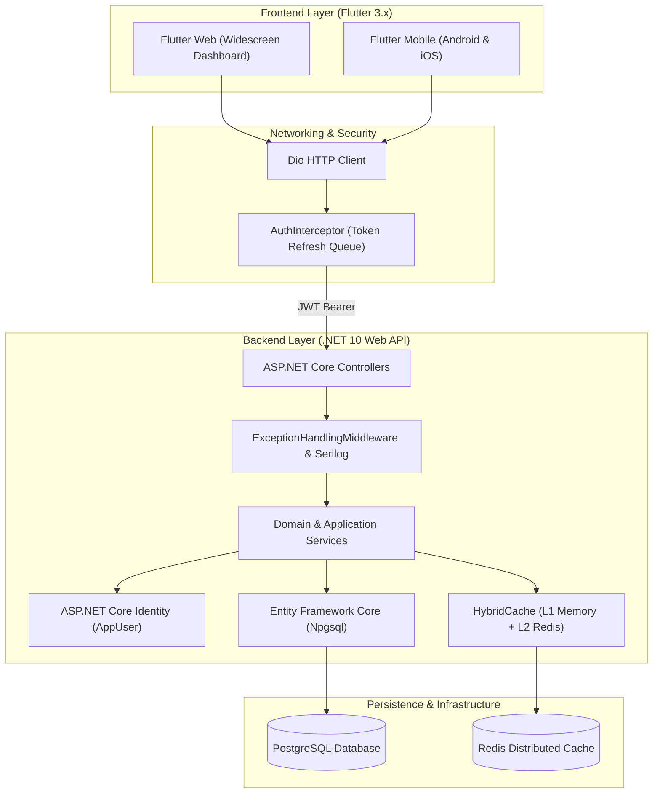

# ProjectHub Documentation Hub

Welcome to the centralized documentation hub for **ProjectHub** — a modern, collaborative project and task management platform built as a monorepo with an **ASP.NET Core 10 Web API** backend and a **Flutter (Mobile & Web)** client.

---

## 📚 Documentation Index

### 1. Domain & Architectural Decisions
| Document | Description |
| :--- | :--- |
| **[Domain Glossary (CONTEXT.md)](../CONTEXT.md)** | Single source of truth for domain vocabulary, canonical definitions, and forbidden synonyms. |
| **[Architecture Decision Records (ADRs)](./adr/)** | Sequenced records of hard-to-reverse architectural decisions, tradeoffs, and rationale. |
| **[Architecture & Decision Index](./architecture-log.md)** | Chronological index mapping project phases to formal ADRs. |

### 2. Product Specs & User Experience
| Document | Description |
| :--- | :--- |
| **[Product Requirements Document (PRD)](./prd.md)** | MVP scope, two-tier user roles, roadmap phases, and post-MVP stability gates. |
| **[User Flows & Journeys](./user-flow.md)** | Post-login user journeys, routing logic, navigation architecture, and responsive UX states. |
| **[Design System Specification](./design-system.md)** | Stitch Deep Slate token architecture, color maps, typography, and component specs. |

### 3. Engineering Architecture Deep Dives
| Document | Description |
| :--- | :--- |
| **[Backend Architecture (.NET 10)](./backend-architecture.md)** | ASP.NET Core API design, EF Core data models, JWT security, and HybridCache. |
| **[Frontend Architecture (Flutter)](./frontend-architecture.md)** | Flutter Feature-First structure, Cubit state management, DI, and UI tokens. |
| **[REST API Reference](./api-reference.md)** | Complete endpoint specifications, request/response schemas, and authentication flow. |

### 4. Setup & Agent Configuration
| Document | Description |
| :--- | :--- |
| **[Full-Stack Setup Guide](./setup-guide.md)** | Step-by-step developer onboarding, database migrations, secrets, and debugging. |
| **[Agent Guidelines & Pointers](../AGENTS.md)** | High-priority agent context pointers and skill triggers. |
| **[Agent Workflow Config](./agents/)** | Issue tracker conventions, triage label vocabulary, and domain doc consumption rules. |

---

## 🏛 System Architecture Overview

---

## 🚀 Quick Links & Repositories

- **Root Workspace:** [ProjectHub Monorepo Root](../README.md)
- **Backend Project:** [.NET 10 API README](../server/README.md)
- **Frontend Project:** [Flutter Client README](../client/README.md)
- **Automation Scripts:** [Local Dev & Build Scripts](../scripts/)
- **CI/CD Pipelines:** [GitHub Actions Workflows](../.github/workflows/)
