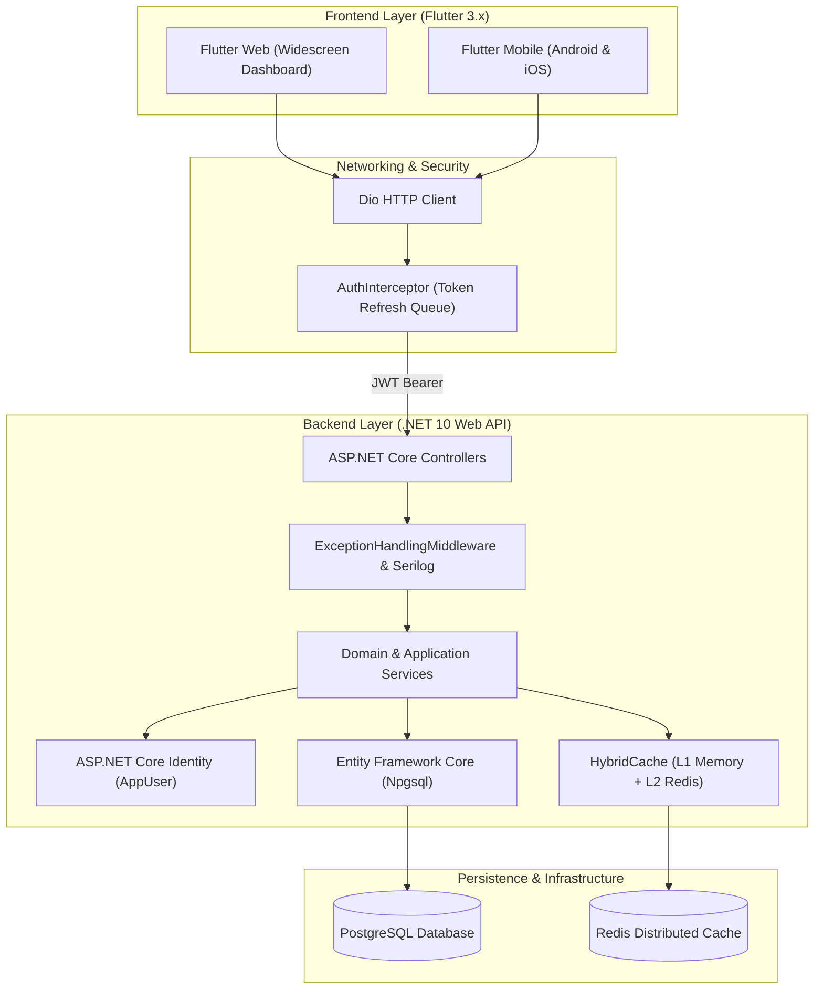

# ProjectHub Documentation Hub

Welcome to the centralized documentation hub for **ProjectHub** — a modern, collaborative project and task management platform built as a polyglot monorepo with an **ASP.NET Core 10 Web API** backend and a **Flutter (Mobile & Web)** client.

---

## 📚 Documentation Index

| Document | Description |
| :--- | :--- |
| **[Product Requirements (PRD)](./prd.md)** | Core product specifications, MVP scope, user roles, roadmap, and phase gates. |
| **[Architecture & Judgment Log](./architecture-log.md)** | Running record of architectural tradeoffs, decisions, and deferred complexity. |
| **[Backend Architecture (.NET 10)](./backend-architecture.md)** | Deep dive into ASP.NET Core API design, EF Core data model, JWT security, and caching. |
| **[Frontend Architecture (Flutter)](./frontend-architecture.md)** | Deep dive into Flutter Feature-First structure, Cubit state management, DI, and UI tokens. |
| **[Design System Specification](./design-system.md)** | Stitch Deep Slate token architecture, color maps, typography, and component specs. |
| **[User Flows & Journeys](./user-flow.md)** | Post-login user journeys, routing logic, navigation architecture, and responsive UX states. |
| **[REST API Reference](./api-reference.md)** | Complete endpoint specifications, request/response schemas, and authentication flow. |
| **[Full-Stack Setup Guide](./setup-guide.md)** | Step-by-step developer onboarding, database migrations, secrets, and debugging. |

---

## 🏛 System Architecture Overview

---

## 🚀 Quick Links & Repositories

- **Root Workspace:** [ProjectHub Monorepo Root](../README.md)
- **Backend Project:** [.NET 10 API README](../server/README.md)
- **Frontend Project:** [Flutter Client README](../client/README.md)
- **Automation Scripts:** [Local Dev & Build Scripts](../scripts/)
- **CI/CD Pipelines:** [GitHub Actions Workflows](../.github/workflows/)

