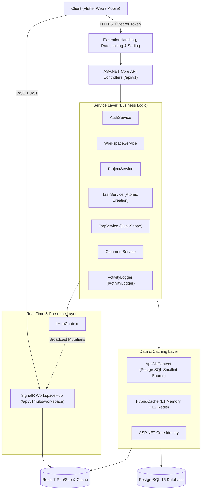
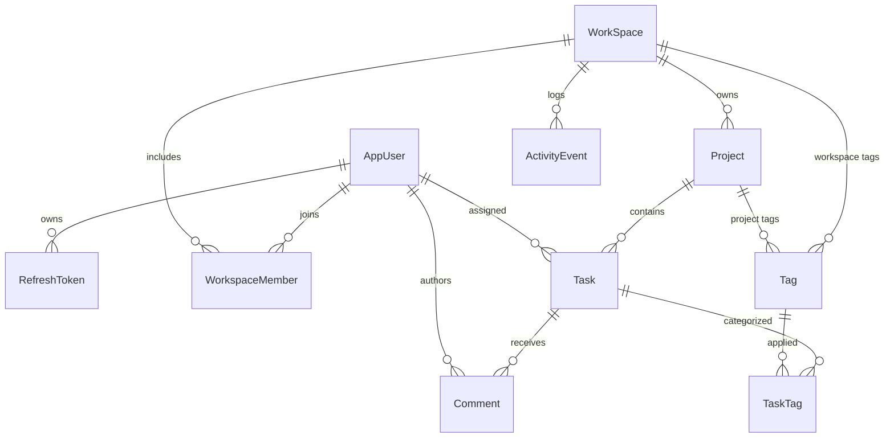
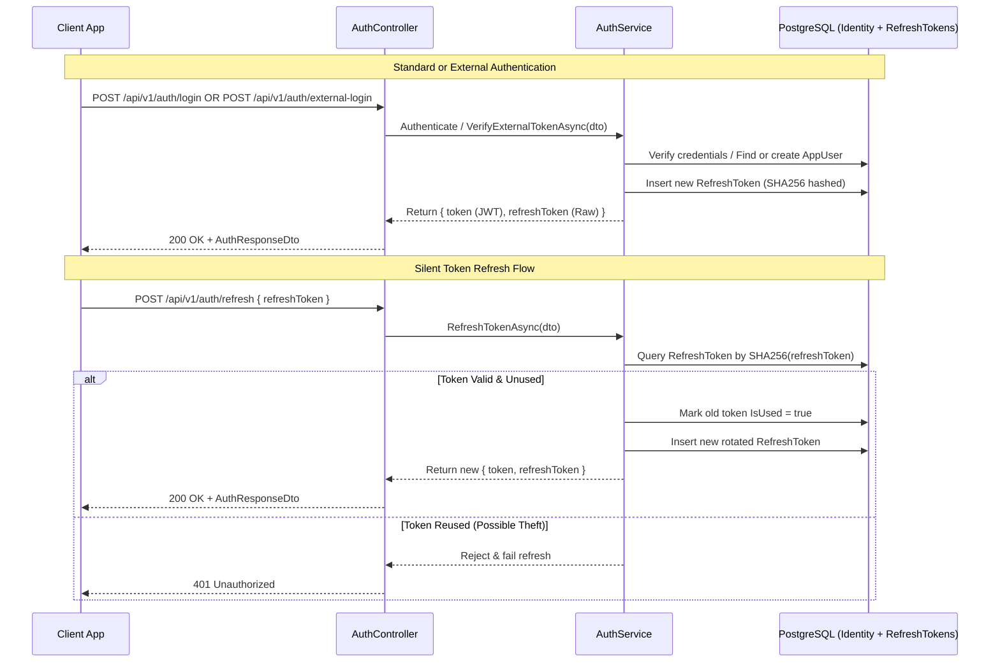

# ProjectHub — Backend Architecture (.NET 10 Web API)

A deep-dive technical specification of the backend implementation for **ProjectHub.Api**.

---

## 1. Architectural Overview

The backend is built with **ASP.NET Core 10** targeting modern REST design principles with layered separation of concerns:



---

## 2. Request Lifecycle & Middleware Pipeline

Every HTTP and WebSocket request traverses the pipeline configured in `Program.cs`:

1. **Serilog Request Logging:** Structured entry/exit logging with duration, HTTP status, and traceId correlation.
2. **ExceptionHandlingMiddleware:** Global `try-catch` boundary converting unhandled exceptions to standardized `ApiErrorResponse` envelopes:
   - `KeyNotFoundException` $\rightarrow$ `404 Not Found`
   - `ArgumentException` $\rightarrow$ `400 Bad Request`
   - `UnauthorizedAccessException` $\rightarrow$ `401 Unauthorized`
   - `ForbiddenException` $\rightarrow$ `403 Forbidden` (distinguishing permission denial from missing auth)
   - General `Exception` $\rightarrow$ `500 Internal Server Error`
3. **HTTPS Redirection & CORS:** Enforces secure transport and allows cross-origin requests for Flutter Web.
4. **Rate Limiting Middleware:** Two-tier protection policy (see [ADR-0013](./adr/0013-two-tier-rate-limiting.md)):
   - **Global Limit:** 100 requests/minute per client IP.
   - **Sensitive Auth Policy:** Partitioned limits on `POST /api/v1/auth/login` (5/min), `POST /api/v1/auth/register` (3/min), and `POST /api/v1/auth/forgot-password` (2/min).
5. **Health Checks:** Diagnostic route `GET /api/v1/health` providing component-level connectivity metrics (`Healthy`, `Degraded` with L1 fallback, or `Unhealthy`, see [ADR-0018](./adr/0018-enum-schema-migration-and-resilient-caching.md)).
6. **Authentication & Authorization:** Validates JWT Bearer tokens and extracts user claims (`sub`, `email`). Handles WebSocket query parameter tokens (`?access_token=...`) via `JwtBearerEvents.OnMessageReceived`.
7. **SignalR Hub Dispatch:** Maps bidirectional `/api/v1/hubs/workspace` endpoint for real-time presence and mutation broadcasting (see [ADR-0017](./adr/0017-signalr-realtime-collaboration-and-dual-scope-tags.md)).
8. **FluentValidation Auto-Validation:** Validates incoming DTOs prior to controller action execution.
9. **Controller Dispatch (/api/v1):** Invokes service layer methods and returns typed `IActionResult` responses (see [ADR-0010](./adr/0010-url-segment-api-versioning.md)).

---

## 3. Data Model & Database Architecture

### Entities & Relationships (aligned with [CONTEXT.md](../CONTEXT.md))

- **`AppUser` (`IdentityUser`):** Represents authenticated users with `Name` and `Bio`.
- **`RefreshToken`:** Tracks user sessions, hashed token strings, expiration timestamps, and revocation flags (see [ADR-0005](./adr/0005-multi-session-sha256-refresh-token-rotation.md)).
- **`WorkSpace`:** The root aggregate boundary for multi-tenant isolation, storing `Name`, `Description`, and a curated `AccentColor` (defaulting to `teal`, see [ADR-0015](./adr/0015-workspace-accent-color-replaces-personal-palette.md)).
- **`WorkspaceMember`:** Join entity connecting `AppUser` to `WorkSpace` with role designation (`Owner` or `Member`). Ownership is derived solely from this relationship (see [ADR-0003](./adr/0003-workspace-owner-single-source-of-truth.md)). Owners can promote or demote members (see [ADR-0018](./adr/0018-enum-schema-migration-and-resilient-caching.md)).
- **`Project`:** Projects contained within a workspace with lifecycle status (`Planning`, `Active`, `Completed`, `Archived`). Project membership is implicit to all workspace members (see [ADR-0001](./adr/0001-implicit-workspace-membership-for-projects.md)), and archived projects are strictly read-only (see [ADR-0002](./adr/0002-strict-read-only-freeze-on-archived-projects.md)).
- **`Task`:** Tasks belonging to a project, featuring status and priority stored as PostgreSQL `smallint` enums with composite indexing on `(ProjectId, Status)` (see [ADR-0018](./adr/0018-enum-schema-migration-and-resilient-caching.md)), due date, creator, and assignee. Removing a workspace member automatically unassigns their tasks (see [ADR-0006](./adr/0006-automatic-task-unassignment-on-member-removal.md)).
- **`Tag` & `TaskTag`:** Categorical labels partitioned into workspace-level and project-scoped tags with deterministic 12-palette color hashing. Join table `TaskTag` enforces a maximum of 5 tags per task with atomic resolution (see [ADR-0017](./adr/0017-signalr-realtime-collaboration-and-dual-scope-tags.md) and [ADR-0018](./adr/0018-enum-schema-migration-and-resilient-caching.md)).
- **`Comment`:** Flat chronological discussion entries attached to tasks with author attribution and real-time push broadcasts (see [ADR-0017](./adr/0017-signalr-realtime-collaboration-and-dual-scope-tags.md)).
- **`ActivityEvent`:** Unified audit trail capturing mutations across workspaces, projects, and tasks (`WorkspaceId`, `ProjectId?`, `TaskId?`, `ActorId`, `EventType`, `Metadata`, `CreatedAt`, see [ADR-0011](./adr/0011-activity-event-audit-trail-and-logger.md)).



---

## 4. Authentication & Security Engine

The authentication system employs multi-session SHA256 hashed refresh tokens with rotation and token reuse detection (see [ADR-0005](./adr/0005-multi-session-sha256-refresh-token-rotation.md)), extended with native external OAuth providers (Google and GitHub, see [ADR-0012](./adr/0012-native-client-external-oauth-integration.md)):



---

## 5. Dedicated Endpoints for Kanban & Operations

To minimize payload overhead and prevent accidental field clobbers during rapid UI updates (see [ADR-0004](./adr/0004-dedicated-patch-endpoints-for-kanban-status-and-assignee.md) and [ADR-0010](./adr/0010-url-segment-api-versioning.md)):

- `PATCH /api/v1/tasks/{id}/status`: Single-field status updates for drag-and-drop moves.
- `PATCH /api/v1/tasks/{id}/assignee`: Single-field reassignment to workspace members.
- `PUT /api/v1/tasks/{id}`: General detail edits (title, description, priority, due date), intentionally omitting status.

---

## 6. High-Performance Caching & Startup Resilience (`HybridCache`)

The API integrates .NET 10's **`HybridCache`** with Redis distributed backend, reinforced with startup resilience (see [ADR-0018](./adr/0018-enum-schema-migration-and-resilient-caching.md)):

- **L1 Cache (In-Memory):** Microsecond read speeds for hot objects on the same process instance.
- **L2 Cache (Redis):** Distributed consistency across multi-instance API deployments.
- **Non-Blocking Resilience:** Redis connection configured with `AbortOnConnectFail = false` and bounded timeouts (`ConnectTimeout = 2000ms`, `SyncTimeout = 1000ms`). Connection initialization is performed asynchronously via `await ConnectionMultiplexer.ConnectAsync(...)` in `Program.cs`. If Redis is offline during startup or runtime, the API boots normally and falls back seamlessly to L1 in-memory caching.
- **Compound Tagging & Invalidation:**
  ```csharp
  // Read with cache
  var profile = await _cache.GetOrCreateAsync(
      $"user:{userId}:profile",
      async token => await FetchUserProfile(userId),
      tags: [$"user:{userId}:profile"]
  );

  // Invalidate on update
  await _cache.RemoveByTagAsync($"user:{userId}:profile");
  ```
- **Role & Membership Invalidation:** Synchronous cache busting across all membership lifecycle events (`RemoveMemberFromWorkspaceAsync`, `UpdateMemberRoleAsync`, `AddMemberToWorkspaceAsync`, `DeleteWorkspaceAsync`) using compound tags `user:{userId}:roles` and `workspace:{workspaceId}:members`.

---

## 7. PostgreSQL Smallint Enum Migration & Atomic Task Creation

To optimize database storage and prevent concurrency anomalies (see [ADR-0018](./adr/0018-enum-schema-migration-and-resilient-caching.md)):

### Database Enum Storage as `smallint`
- `Task.Status` and `Task.Priority` are modeled as C# enums (`TaskItemStatus`, `TaskItemPriority`) and mapped to PostgreSQL `smallint` (2 bytes) via EF Core value conversion (`.HasConversion<short>()`).
- A composite index is defined on `(ProjectId, Status)`. Switching from `varchar(50)` to `smallint` reduces index footprint by over 80% and allows query plans to perform direct index seeks without requiring expression-based `LOWER()` indexing.
- **DTO Wire Preservation:** To preserve 100% backward compatibility for the Flutter client and avoid generic model-binding deserialization errors, all external HTTP DTOs (`TaskResponseDto`, `CreateTaskRequestDto`, `UpdateTaskRequestDto`, `UpdateTaskStatusDto`) strictly preserve `string` properties. Conversions are centralized in `TaskEnumExtensions`.

### Atomic Task Creation with Pre-Save Tag Resolution
- Tag validation occurs strictly before any entity is attached to EF Core's change tracker.
- A maximum of 5 tags is enforced at the validation layer via FluentValidation (`CreateTaskRequestDtoValidator`).
- `TaskService.CreateTaskAsync` compares the count of resolved tags against the count of requested distinct tag IDs. If any tag is missing, deleted, or belongs to a different project/workspace, the request is rejected with HTTP 400 Bad Request, identifying the specific offending IDs.
- Resolved tags are attached directly to `task.TaskTags` in memory, committing both the parent task and join entities in a single `SaveChangesAsync()` call wrapped within an implicit database transaction.

---

## 8. Activity Logging & Audit Trail Architecture

Mutations across entities trigger event logging through a decoupled `IActivityLogger` service (see [ADR-0011](./adr/0011-activity-event-audit-trail-and-logger.md)):

- **Interface:** Injected into `WorkspaceService`, `ProjectService`, and `TaskService`.
- **Event Types:** `WorkspaceCreated`, `WorkspaceUpdated`, `MemberAdded`, `MemberRemoved`, `MemberRoleUpdated`, `ProjectCreated`, `ProjectStatusChanged`, `ProjectArchived`, `TaskCreated`, `TaskStatusChanged`, `TaskAssigned`, `TaskDeleted`.
- **Feed Queries:**
  - `GET /api/v1/workspaces/{id}/activity`: Workspace-level audit feed for the Dashboard.
  - `GET /api/v1/projects/{id}/activity`: Project-scoped activity history for project detail tabs.

---

## 9. Real-Time Push Synchronization & Presence Engine (SignalR)

ProjectHub provides real-time push synchronization and online presence (see [ADR-0017](./adr/0017-signalr-realtime-collaboration-and-dual-scope-tags.md)):

- **Authenticated Hub:** Single hub (`WorkspaceHub`) exposed at `/api/v1/hubs/workspace` with JWT authentication via query string `?access_token=...`.
- **Workspace Group Partitioning:** Connections join groups partitioned strictly by workspace (`workspace-{workspaceId}`).
- **Mutation Broadcasting:** Service layer methods inject `IHubContext<WorkspaceHub>` to broadcast events immediately following database commits:
  - **Tier 1 (Board Mutations):** `TaskCreated`, `TaskStatusChanged`, `TaskAssigned`, `TaskDeleted`.
  - **Tier 2 (Collaboration):** `CommentAdded`, `CommentDeleted`.
- **Distributed Presence Sets:** Active users are tracked via Redis Sets (`workspace:{workspaceId}:online_users`) with automatic group broadcasts (`PresenceChanged`) on connect, disconnect, and WebSocket ping/pong timeouts (30s). When Redis is unavailable, an in-process concurrent dictionary fallback maintains single-instance presence.

---

## 10. Dual-Scope Tags & Task Comments Architecture

- **Dual-Scope Tag Model:** Tags (`Tag` entity) are owned by a workspace (`WorkspaceId`) with an optional project scope (`ProjectId?`):
  - *Workspace-Level Tags* (`ProjectId == null`): Created and deleted by the Workspace Owner; reusable across all projects in the workspace.
  - *Project-Level Tags* (`ProjectId != null`): Scoped strictly to tasks within that project; created/deleted by Workspace Owner or Project Creator.
  - *Deterministic Color Hashing:* Tag colors are computed algorithmically from tag names against a curated 12-color accessible palette, guaranteeing consistent contrast in dark and light themes without manual palette selection.
- **Flat Chronological Comments:** Modeled as single-level flat chronological comments (`Comment` entity) with author attribution and real-time broadcast push. Task cards surface an aggregated `CommentCount` counter.

---

## 11. Workspace Member Role Governance & Access Control

Role management is governed strictly through `WorkspaceMember.Role` (`Owner` vs `Member`, see [ADR-0003](./adr/0003-workspace-owner-single-source-of-truth.md) and [ADR-0018](./adr/0018-enum-schema-migration-and-resilient-caching.md)):

- **Role Mutation:** `PUT /api/v1/workspaces/{id}/members/{userId}/role` allows Workspace Owners to promote members to `Owner` or demote co-owners to `Member`.
- **Protection Rules:** Cannot demote or remove the last remaining Owner of a workspace.
- **Synchronous Cache Busting:** Demotions or promotions immediately invalidate cached role sets (`user:{userId}:roles`), preventing stale privilege window exploits.


