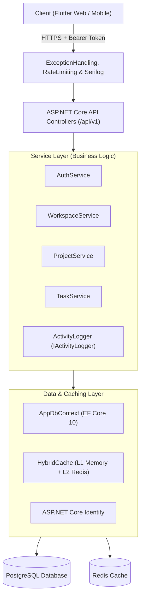
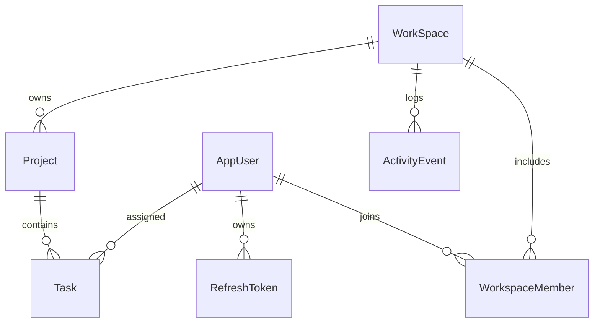
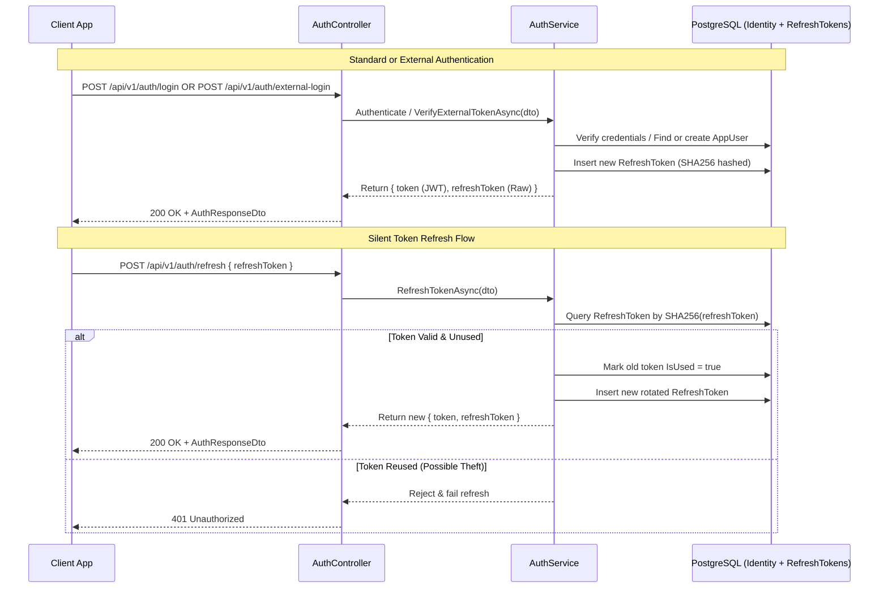

# ProjectHub — Backend Architecture (.NET 10 Web API)

A deep-dive technical specification of the backend implementation for **ProjectHub.Api**.

---

## 1. Architectural Overview

The backend is built with **ASP.NET Core 10** targeting modern REST design principles with layered separation of concerns:



---

## 2. Request Lifecycle & Middleware Pipeline

Every HTTP request traverses the pipeline configured in `Program.cs`:

1. **Serilog Request Logging:** Structured entry/exit logging with duration, HTTP status, and traceId correlation.
2. **ExceptionHandlingMiddleware:** Global `try-catch` boundary converting unhandled exceptions to standardized `ApiErrorResponse` envelopes:
   - `KeyNotFoundException` $\rightarrow$ `404 Not Found`
   - `ArgumentException` $\rightarrow$ `400 Bad Request`
   - `UnauthorizedAccessException` $\rightarrow$ `401 Unauthorized`
   - `ForbiddenException` $\rightarrow$ `403 Forbidden` (distinguishing permission denial from missing auth)
   - General `Exception` $\rightarrow$ `500 Internal Server Error`
3. **HTTPS Redirection & CORS:** Enforces secure transport and allows cross-origin requests for Flutter Web.
4. **Rate Limiting Middleware:** Two-tier protection policy (see [ADR-0013](./adr/0013-two-tier-rate-limiting.md)):
   - **Global Limit:** 100 requests/minute per client IP.
   - **Sensitive Auth Policy:** Partitioned limits on `POST /api/v1/auth/login` (5/min), `POST /api/v1/auth/register` (3/min), and `POST /api/v1/auth/forgot-password` (2/min).
5. **Health Checks:** Diagnostic route `GET /api/v1/health` providing database and Redis connectivity metrics.
6. **Authentication & Authorization:** Validates JWT Bearer tokens and extracts user claims (`sub`, `email`).
7. **FluentValidation Auto-Validation:** Validates incoming DTOs prior to controller action execution.
8. **Controller Dispatch (/api/v1):** Invokes service layer methods and returns typed `IActionResult` responses (see [ADR-0010](./adr/0010-url-segment-api-versioning.md)).

---

## 3. Data Model & Database Architecture

### Entities & Relationships (aligned with [CONTEXT.md](../CONTEXT.md))

- **`AppUser` (`IdentityUser`):** Represents authenticated users with `Name` and `Bio`.
- **`RefreshToken`:** Tracks user sessions, hashed token strings, expiration timestamps, and revocation flags (see [ADR-0005](./adr/0005-multi-session-sha256-refresh-token-rotation.md)).
- **`WorkSpace`:** The root aggregate boundary for multi-tenant isolation.
- **`WorkspaceMember`:** Join entity connecting `AppUser` to `WorkSpace` with role designation (`Owner` or `Member`). Ownership is derived solely from this relationship (see [ADR-0003](./adr/0003-workspace-owner-single-source-of-truth.md)).
- **`Project`:** Projects contained within a workspace with lifecycle status (`Planning`, `Active`, `Completed`, `Archived`). Project membership is implicit to all workspace members (see [ADR-0001](./adr/0001-implicit-workspace-membership-for-projects.md)), and archived projects are strictly read-only (see [ADR-0002](./adr/0002-strict-read-only-freeze-on-archived-projects.md)).
- **`Task`:** Tasks belonging to a project, featuring status, priority, due date, creator, and assignee. Removing a workspace member automatically unassigns their tasks (see [ADR-0006](./adr/0006-automatic-task-unassignment-on-member-removal.md)).
- **`ActivityEvent`:** Unified audit trail and activity log capturing mutations across workspaces, projects, and tasks (`WorkspaceId`, `ProjectId?`, `TaskId?`, `ActorId`, `EventType`, `Metadata`, `CreatedAt`, see [ADR-0011](./adr/0011-activity-event-audit-trail-and-logger.md)).



---

## 4. Authentication & Security Engine

The authentication system employs multi-session SHA256 hashed refresh tokens with rotation and token reuse detection (see [ADR-0005](./adr/0005-multi-session-sha256-refresh-token-rotation.md)), extended with native external OAuth providers (Google and GitHub, see [ADR-0012](./adr/0012-native-client-external-oauth-integration.md)):



---

## 5. Dedicated Endpoints for Kanban & Operations

To minimize payload overhead and prevent accidental field clobbers during rapid UI updates (see [ADR-0004](./adr/0004-dedicated-patch-endpoints-for-kanban-status-and-assignee.md) and [ADR-0010](./adr/0010-url-segment-api-versioning.md)):

- `PATCH /api/v1/tasks/{id}/status`: Single-field status updates for drag-and-drop moves.
- `PATCH /api/v1/tasks/{id}/assignee`: Single-field reassignment to workspace members.
- `PUT /api/v1/tasks/{id}`: General detail edits (title, description, priority, due date), intentionally omitting status.

---

## 6. High-Performance Caching (`HybridCache`)

The API integrates .NET 10's **`HybridCache`** with Redis distributed backend:

- **L1 Cache (In-Memory):** Microsecond read speeds for hot objects on the same process instance.
- **L2 Cache (Redis):** Distributed consistency across multi-instance API deployments.
- **Tagging & Eviction:**
  ```csharp
  // Read with cache
  var profile = await _cache.GetOrCreateAsync(
      $"user:{userId}:profile",
      async token => await FetchUserProfile(userId),
      tags: [$"user:{userId}:profile"]
  );

  // Invalidate on update
  await _cache.RemoveByTagAsync($"user:{userId}:profile");
  ```

---

## 7. Validation & Mapping Conventions

- **FluentValidation:** Defined in `Validators/` with rules for string lengths, email formats, and enum boundaries. Domain enums (`TaskItemStatus`, `TaskItemPriority`, `ProjectStatus`, `ActivityEventType`) are stored as readable strings.
- **AutoMapper:** Centralized mapping profiles converting domain entities to lightweight response DTOs, avoiding entity exposure.

---

## 8. Activity Logging & Audit Trail Architecture

Mutations across entities trigger event logging through a decoupled `IActivityLogger` service (see [ADR-0011](./adr/0011-activity-event-audit-trail-and-logger.md)):

- **Interface:** Injected into `WorkspaceService`, `ProjectService`, and `TaskService`.
- **Event Types:** `WorkspaceCreated`, `WorkspaceUpdated`, `MemberAdded`, `MemberRemoved`, `ProjectCreated`, `ProjectStatusChanged`, `ProjectArchived`, `TaskCreated`, `TaskStatusChanged`, `TaskAssigned`, `TaskDeleted`.
- **Feed Queries:**
  - `GET /api/v1/workspaces/{id}/activity`: Workspace-level audit feed for the Dashboard.
  - `GET /api/v1/projects/{id}/activity`: Project-scoped activity history for project detail tabs.

