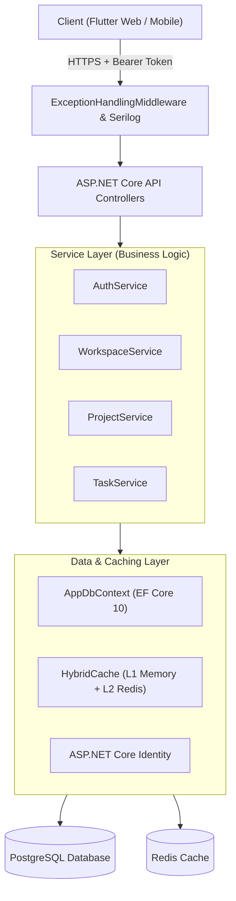
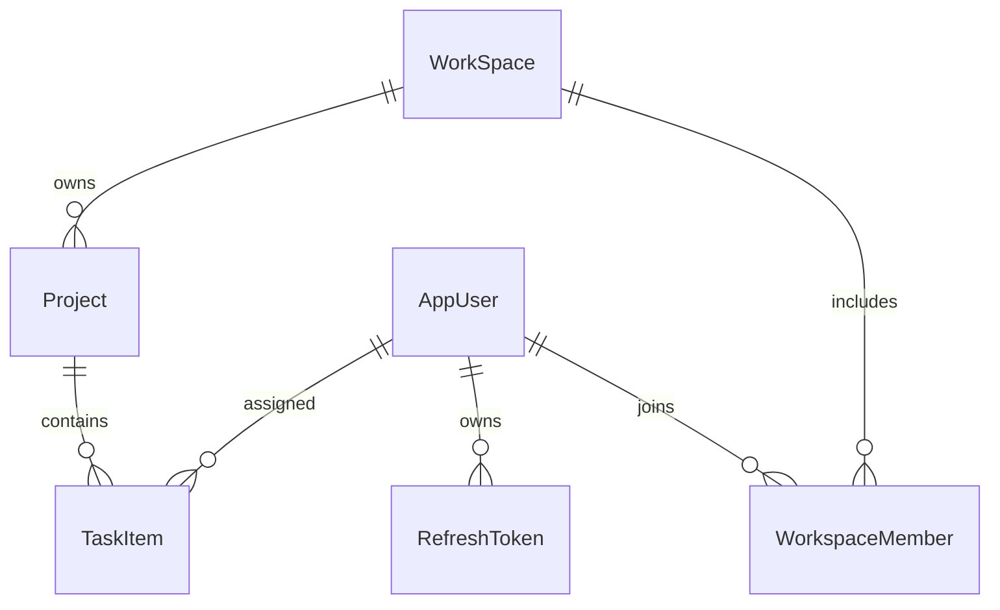
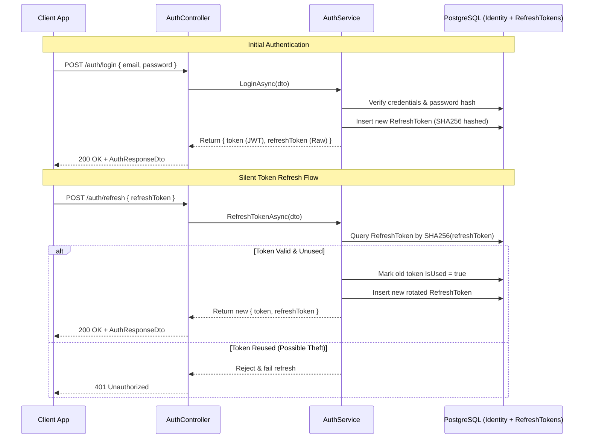

# ProjectHub — Backend Architecture (.NET 10 Web API)

A deep-dive technical specification of the backend implementation for **ProjectHub.Api**.

---

## 1. Architectural Overview

The backend is built with **ASP.NET Core 10** targeting modern REST design principles with layered separation of concerns:



---

## 2. Request Lifecycle & Middleware Pipeline

Every HTTP request traverses the pipeline configured in `Program.cs`:

1. **Serilog Request Logging:** Structured entry/exit logging with duration, HTTP status, and user context.
2. **ExceptionHandlingMiddleware:** Global `try-catch` boundary converting unhandled exceptions to standardized `ApiErrorResponse` envelopes:
   - `KeyNotFoundException` $\rightarrow$ `404 Not Found`
   - `ArgumentException` $\rightarrow$ `400 Bad Request`
   - `UnauthorizedAccessException` $\rightarrow$ `401 Unauthorized`
   - `ForbiddenException` $\rightarrow$ `403 Forbidden`
   - General `Exception` $\rightarrow$ `500 Internal Server Error`
3. **HTTPS Redirection & Static Files:** Enforces secure transport.
4. **Authentication & Authorization:** Validates JWT Bearer tokens and extracts user claims (`sub`, `email`).
5. **FluentValidation Auto-Validation:** Validates incoming DTOs prior to controller action execution.
6. **Controller Dispatch:** Invokes service layer methods and returns typed `IActionResult` responses.

---

## 3. Data Model & Database Architecture

### Entities & Relationships

- **`AppUser` (`IdentityUser`):** Represents authenticated users with `Name` and `Bio`.
- **`RefreshToken`:** Tracks user sessions, hashed token strings, expiration timestamps, and revocation flags.
- **`WorkSpace`:** The root aggregate boundary for multi-tenant isolation.
- **`WorkspaceMember`:** Join entity connecting `AppUser` to `WorkSpace` with role designation (`Owner` or `Member`).
- **`Project`:** Projects contained within a workspace with lifecycle status (`Planning`, `Active`, `Completed`, `Archived`).
- **`Task` (`TaskItem`):** Tasks belonging to a project, featuring status, priority, due date, creator, and assignee.



---

## 4. Authentication & Security Engine



---

## 5. High-Performance Caching (`HybridCache`)

The API integrates .NET 10's **`HybridCache`** with Redis distributed backend:

- **L1 Cache (In-Memory):** Microsecond read speeds for hot objects on the same process instance.
- **L2 Cache (Redis):** Distributed consistency across multi-instance API deployments.
- **Tagging & Eviction:**
  ```csharp
  // Read with cache
  var profile = await _cache.GetOrCreateAsync(
      $"user:{userId}:profile",
      async token => await FetchUserProfile(userId),
      tags: [$"user:{userId}:profile"]
  );

  // Invalidate on update
  await _cache.RemoveByTagAsync($"user:{userId}:profile");
  ```

---

## 6. Validation & Mapping Conventions

- **FluentValidation:** Defined in `Validators/` with rules for string lengths, email formats, and enum boundaries.
- **AutoMapper:** Centralized mapping profiles converting domain entities to lightweight response DTOs, avoiding entity exposure.

