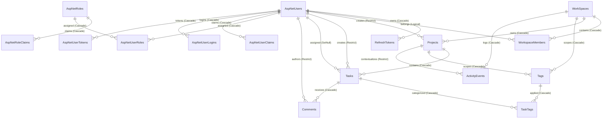

# ProjectHub — Database Schema Specification

This document provides a comprehensive, authoritative specification of the PostgreSQL relational database schema powering **ProjectHub.Api**. It documents all tables, columns, data types, constraints, defaults, indexes, foreign keys, cascade delete rules, and entity relationships as configured in Entity Framework Core 10 (`AppDbContext`) and PostgreSQL 16.

---

## 1. Database Architecture Overview

- **Engine:** PostgreSQL 16
- **ORM / Provider:** Entity Framework Core 10 with `Npgsql.EntityFrameworkCore.PostgreSQL` (v10.0.11)
- **Identity Strategy:** `NpgsqlPropertyBuilderExtensions.UseIdentityByDefaultColumn` for integer primary keys (`GENERATED BY DEFAULT AS IDENTITY`).
- **Date & Time Strategy:** All timestamps are stored as `timestamp with time zone` (UTC). Applied via EF Core model conventions using `UtcDateTimeConverter` and `NullableUtcDateTimeConverter` (see [ADR-0018](./adr/0018-enum-schema-migration-and-resilient-caching.md)).
- **Enum Storage Strategy:**
  - `Task.Status` and `Task.Priority`: Stored as PostgreSQL `smallint` (0-indexed integers) with composite indexes for performance (see [ADR-0018](./adr/0018-enum-schema-migration-and-resilient-caching.md)).
  - `Project.Status`: Stored as `character varying(50)` strings.
  - `ActivityEvent.EventType`: Stored as `character varying(50)` strings.
  - `WorkspaceMember.Role`: Stored as `text` strings (`Owner`, `Member`).
- **Multi-Tenancy Boundary:** `WorkSpaces` serves as the root isolation aggregate. All sub-resources (`WorkspaceMember`, `Project`, `Tag`, `ActivityEvent`) maintain a direct or indirect foreign key back to the workspace root.

---

## 2. Entity-Relationship (ER) Diagram

---

## 3. Detailed Table Specifications

### 3.1 `WorkSpaces`
Root organizational boundary and security perimeter (see [CONTEXT.md](../CONTEXT.md)).

| Column | PostgreSQL Type | C# Type | Nullable | Constraints & Defaults | Description |
| :--- | :--- | :--- | :---: | :--- | :--- |
| `Id` | `integer` | `int` | No | PK, `IDENTITY` | Unique workspace identifier |
| `Name` | `text` | `string` | No | Required | Display name of the workspace |
| `Description` | `text` | `string` | No | Default `""` | Description of the workspace |
| `AccentColor` | `character varying(20)` | `string` | No | Max 20, Default `'teal'` | Wayfinding accent from 10 vetted colors (ADR-0015) |
| `CreatedAt` | `timestamp with time zone` | `DateTime` | No | UTC converter | Timestamp when workspace was created |
| `UpdatedAt` | `timestamp with time zone` | `DateTime` | No | UTC converter | Timestamp when workspace was last modified |

- **Primary Key:** `PK_WorkSpaces` on `Id`
- **Inbound Relations:** None
- **Outbound Relations (Cascades):**
  - Cascades delete to `WorkspaceMembers`
  - Cascades delete to `Projects`
  - Cascades delete to `Tags`
  - Cascades delete to `ActivityEvents`

---

### 3.2 `WorkspaceMembers`
Membership association linking an authenticated `AppUser` to a `WorkSpace` with role-based authority (see [ADR-0003](./adr/0003-workspace-owner-single-source-of-truth.md)).

| Column | PostgreSQL Type | C# Type | Nullable | Constraints & Defaults | Description |
| :--- | :--- | :--- | :---: | :--- | :--- |
| `Id` | `integer` | `int` | No | PK, `IDENTITY` | Membership record ID |
| `WorkspaceId` | `integer` | `int` | No | FK to `WorkSpaces.Id` | Workspace aggregate reference |
| `UserId` | `text` | `string` | No | References `AspNetUsers.Id` | User account ID |
| `Role` | `text` | `string` | No | Values: `'Owner'`, `'Member'` | Access authorization role |
| `CreatedAt` | `timestamp with time zone` | `DateTime` | No | UTC converter | Timestamp when member joined |
| `UpdatedAt` | `timestamp with time zone` | `DateTime` | No | UTC converter | Timestamp when role/record was updated |

- **Primary Key:** `PK_WorkspaceMembers` on `Id`
- **Indexes:**
  - `IX_WorkspaceMembers_WorkspaceId_UserId`: `UNIQUE` on `(WorkspaceId, UserId)` — prevents duplicate memberships.
- **Foreign Keys:**
  - `FK_WorkspaceMembers_WorkSpaces_WorkspaceId`: `WorkspaceId` $\rightarrow$ `WorkSpaces(Id)` `ON DELETE CASCADE`.

---

### 3.3 `Projects`
Scoped initiative containing tasks. Project membership is implicit to all workspace members (see [ADR-0001](./adr/0001-implicit-workspace-membership-for-projects.md)).

| Column | PostgreSQL Type | C# Type | Nullable | Constraints & Defaults | Description |
| :--- | :--- | :--- | :---: | :--- | :--- |
| `Id` | `integer` | `int` | No | PK, `IDENTITY` | Project identifier |
| `WorkspaceId` | `integer` | `int` | No | FK to `WorkSpaces.Id` | Parent workspace identifier |
| `Name` | `character varying(100)` | `string` | No | Max 100, Required | Title/name of the project |
| `Description` | `character varying(500)` | `string` | No | Max 500 | Project summary / scope |
| `Status` | `character varying(50)` | `string` | No | Max 50, Required | Lifecycle: `Planning`, `Active`, `Completed`, `Archived` |
| `DueDate` | `timestamp with time zone` | `DateTime?` | Yes | UTC converter | Target completion date |
| `CreatedBy` | `text` | `string` | No | FK to `AspNetUsers.Id` | Creator user ID |
| `CreatedAt` | `timestamp with time zone` | `DateTime` | No | UTC converter | Timestamp created |
| `UpdatedAt` | `timestamp with time zone` | `DateTime` | No | UTC converter | Timestamp last updated |

- **Primary Key:** `PK_Projects` on `Id`
- **Indexes:**
  - `IX_Projects_WorkspaceId`: Non-unique on `WorkspaceId`
  - `IX_Projects_CreatedBy`: Non-unique on `CreatedBy`
- **Foreign Keys:**
  - `FK_Projects_WorkSpaces_WorkspaceId`: `WorkspaceId` $\rightarrow$ `WorkSpaces(Id)` `ON DELETE CASCADE`.
  - `FK_Projects_AspNetUsers_CreatedBy`: `CreatedBy` $\rightarrow$ `AspNetUsers(Id)` `ON DELETE RESTRICT`.
- **Outbound Relations (Cascades):**
  - Cascades delete to child `Tasks`
  - Cascades delete to project-scoped `Tags`

---

### 3.4 `Tasks`
Actionable unit of work tracked across Kanban board columns (see [ADR-0018](./adr/0018-enum-schema-migration-and-resilient-caching.md)).

| Column | PostgreSQL Type | C# Type | Nullable | Constraints & Defaults | Description |
| :--- | :--- | :--- | :---: | :--- | :--- |
| `Id` | `integer` | `int` | No | PK, `IDENTITY` | Task identifier |
| `ProjectId` | `integer` | `int` | No | FK to `Projects.Id` | Parent project identifier |
| `Title` | `character varying(200)` | `string` | No | Max 200, Required | Task title |
| `Description` | `character varying(2000)` | `string` | No | Max 2000 | Task details / body |
| `Status` | `smallint` | `TaskItemStatus` | No | Required | `0`=Backlog, `1`=Todo, `2`=InProgress, `3`=Review, `4`=Done |
| `Priority` | `smallint` | `TaskItemPriority` | No | Required | `0`=Low, `1`=Medium, `2`=High, `3`=Urgent |
| `AssigneeId` | `text` | `string?` | Yes | FK to `AspNetUsers.Id` | Assigned workspace member user ID |
| `CreatedBy` | `text` | `string` | No | FK to `AspNetUsers.Id` | Creator member user ID |
| `DueDate` | `timestamp with time zone` | `DateTime?` | Yes | UTC converter | Optional task due date |
| `CreatedAt` | `timestamp with time zone` | `DateTime` | No | UTC converter | Timestamp created |
| `UpdatedAt` | `timestamp with time zone` | `DateTime` | No | UTC converter | Timestamp last modified |

- **Primary Key:** `PK_Tasks` on `Id`
- **Indexes:**
  - `IX_Tasks_ProjectId_Status`: Composite non-unique index on `(ProjectId, Status)` — optimized for Kanban board queries.
  - `IX_Tasks_AssigneeId`: Non-unique on `AssigneeId` — optimized for "My Tasks" queries.
  - `IX_Tasks_CreatedBy`: Non-unique on `CreatedBy`.
- **Foreign Keys:**
  - `FK_Tasks_Projects_ProjectId`: `ProjectId` $\rightarrow$ `Projects(Id)` `ON DELETE CASCADE`.
  - `FK_Tasks_AspNetUsers_CreatedBy`: `CreatedBy` $\rightarrow$ `AspNetUsers(Id)` `ON DELETE RESTRICT`.
  - `FK_Tasks_AspNetUsers_AssigneeId`: `AssigneeId` $\rightarrow$ `AspNetUsers(Id)` `ON DELETE SET NULL`.
- **Outbound Relations (Cascades):**
  - Cascades delete to `TaskTags`
  - Cascades delete to `Comments`

---

### 3.5 `Tags`
Categorical classification labels partitioned into workspace-level (`ProjectId IS NULL`) or project-scoped (`ProjectId IS NOT NULL`) (see [ADR-0017](./adr/0017-signalr-realtime-collaboration-and-dual-scope-tags.md)).

| Column | PostgreSQL Type | C# Type | Nullable | Constraints & Defaults | Description |
| :--- | :--- | :--- | :---: | :--- | :--- |
| `Id` | `integer` | `int` | No | PK, `IDENTITY` | Tag identifier |
| `WorkspaceId` | `integer` | `int` | No | FK to `WorkSpaces.Id` | Workspace scope identifier |
| `ProjectId` | `integer` | `int?` | Yes | FK to `Projects.Id` | Optional project scope (null = workspace-wide) |
| `Name` | `character varying(30)` | `string` | No | Max 30, Required | Tag name label |
| `Color` | `character varying(20)` | `string` | No | Max 20, Required | Hex code (`#RRGGBB`) hashed from TagPalette |
| `CreatedAt` | `timestamp with time zone` | `DateTime` | No | UTC converter | Timestamp created |

- **Primary Key:** `PK_Tags` on `Id`
- **Indexes:**
  - `IX_Tags_WorkspaceId_ProjectId`: Composite index on `(WorkspaceId, ProjectId)` for scoped tag lookups.
  - `IX_Tags_ProjectId`: Non-unique on `ProjectId`.
- **Foreign Keys:**
  - `FK_Tags_WorkSpaces_WorkspaceId`: `WorkspaceId` $\rightarrow$ `WorkSpaces(Id)` `ON DELETE CASCADE`.
  - `FK_Tags_Projects_ProjectId`: `ProjectId` $\rightarrow$ `Projects(Id)` `ON DELETE CASCADE`.
- **Outbound Relations (Cascades):**
  - Cascades delete to `TaskTags`.

---

### 3.6 `TaskTags`
Many-to-many join table linking `Tasks` and `Tags` (enforced maximum of 5 tags per task at the business logic layer, see [ADR-0018](./adr/0018-enum-schema-migration-and-resilient-caching.md)).

| Column | PostgreSQL Type | C# Type | Nullable | Constraints & Defaults | Description |
| :--- | :--- | :--- | :---: | :--- | :--- |
| `TaskId` | `integer` | `int` | No | Composite PK, FK to `Tasks.Id` | Task reference |
| `TagId` | `integer` | `int` | No | Composite PK, FK to `Tags.Id` | Tag reference |

- **Primary Key:** `PK_TaskTags` on `(TaskId, TagId)`
- **Indexes:**
  - `IX_TaskTags_TagId`: Non-unique on `TagId` for reverse tag lookup.
- **Foreign Keys:**
  - `FK_TaskTags_Tasks_TaskId`: `TaskId` $\rightarrow$ `Tasks(Id)` `ON DELETE CASCADE`.
  - `FK_TaskTags_Tags_TagId`: `TagId` $\rightarrow$ `Tags(Id)` `ON DELETE CASCADE`.

---

### 3.7 `Comments`
Chronological discussion remarks attached to tasks (see [ADR-0017](./adr/0017-signalr-realtime-collaboration-and-dual-scope-tags.md)).

| Column | PostgreSQL Type | C# Type | Nullable | Constraints & Defaults | Description |
| :--- | :--- | :--- | :---: | :--- | :--- |
| `Id` | `integer` | `int` | No | PK, `IDENTITY` | Comment identifier |
| `TaskId` | `integer` | `int` | No | FK to `Tasks.Id` | Parent task reference |
| `AuthorId` | `text` | `string` | No | FK to `AspNetUsers.Id` | Comment author user ID |
| `Content` | `character varying(2000)` | `string` | No | Max 2000, Required | Comment textual body |
| `CreatedAt` | `timestamp with time zone` | `DateTime` | No | UTC converter | Timestamp posted |
| `UpdatedAt` | `timestamp with time zone` | `DateTime` | No | UTC converter | Timestamp last edited |

- **Primary Key:** `PK_Comments` on `Id`
- **Indexes:**
  - `IX_Comments_TaskId_CreatedAt`: Composite index on `(TaskId, CreatedAt)` — optimizes chronological comment fetching.
  - `IX_Comments_AuthorId`: Non-unique on `AuthorId`.
- **Foreign Keys:**
  - `FK_Comments_Tasks_TaskId`: `TaskId` $\rightarrow$ `Tasks(Id)` `ON DELETE CASCADE`.
  - `FK_Comments_AspNetUsers_AuthorId`: `AuthorId` $\rightarrow$ `AspNetUsers(Id)` `ON DELETE RESTRICT`.

---

### 3.8 `ActivityEvents`
Immutable audit log and activity timeline recording mutations across workspaces, projects, and tasks (see [ADR-0011](./adr/0011-activity-event-audit-trail-and-logger.md)).

| Column | PostgreSQL Type | C# Type | Nullable | Constraints & Defaults | Description |
| :--- | :--- | :--- | :---: | :--- | :--- |
| `Id` | `integer` | `int` | No | PK, `IDENTITY` | Activity event identifier |
| `WorkspaceId` | `integer` | `int` | No | FK to `WorkSpaces.Id` | Workspace scope reference |
| `ProjectId` | `integer` | `int?` | Yes | FK to `Projects.Id` | Optional project scope reference |
| `TaskId` | `integer` | `int?` | Yes | Logical reference | Optional task ID reference |
| `ActorId` | `text` | `string` | No | Logical reference | User ID of the action initiator |
| `ActorName` | `character varying(100)` | `string` | No | Max 100, Required | Display name of initiator at event time |
| `EventType` | `character varying(50)` | `string` | No | Max 50, Required | String representation of `ActivityEventType` |
| `Metadata` | `character varying(4000)` | `string?` | Yes | Max 4000 | JSON payload with event delta details |
| `CreatedAt` | `timestamp with time zone` | `DateTime` | No | UTC converter | Timestamp event occurred |

- **Primary Key:** `PK_ActivityEvents` on `Id`
- **Indexes:**
  - `IX_ActivityEvents_WorkspaceId_CreatedAt`: Composite index on `(WorkspaceId, CreatedAt)` for workspace timeline feeds.
  - `IX_ActivityEvents_ProjectId_CreatedAt`: Composite index on `(ProjectId, CreatedAt)` for project timeline feeds.
- **Foreign Keys:**
  - `FK_ActivityEvents_WorkSpaces_WorkspaceId`: `WorkspaceId` $\rightarrow$ `WorkSpaces(Id)` `ON DELETE CASCADE`.
  - `FK_ActivityEvents_Projects_ProjectId`: `ProjectId` $\rightarrow$ `Projects(Id)` (Optional reference).

---

### 3.9 `RefreshTokens`
Multi-session refresh token rotation ledger for JWT renewal and revocation (see [ADR-0005](./adr/0005-multi-session-sha256-refresh-token-rotation.md)).

| Column | PostgreSQL Type | C# Type | Nullable | Constraints & Defaults | Description |
| :--- | :--- | :--- | :---: | :--- | :--- |
| `Id` | `integer` | `int` | No | PK, `IDENTITY` | Refresh token identifier |
| `UserId` | `text` | `string` | No | FK to `AspNetUsers.Id` | Owning user account ID |
| `TokenHash` | `character varying(128)` | `string` | No | Max 128, Unique | SHA-256 hash of refresh token string |
| `ReplacedByTokenHash` | `character varying(128)` | `string?` | Yes | Max 128 | SHA-256 hash of replacement token upon rotation |
| `IsUsed` | `boolean` | `bool` | No | Default `false` | Indicates whether token has been consumed |
| `CreatedAt` | `timestamp with time zone` | `DateTime` | No | UTC converter | Token issue timestamp |
| `ExpiresAt` | `timestamp with time zone` | `DateTime` | No | UTC converter | Expiration boundary (e.g. 7 days) |
| `RevokedAt` | `timestamp with time zone` | `DateTime?` | Yes | UTC converter | Revocation timestamp if invalidated |
| `RevocationReason` | `text` | `string?` | Yes | Nullable | Reason for revocation (e.g. rotation, logout) |

- **Primary Key:** `PK_RefreshTokens` on `Id`
- **Indexes:**
  - `IX_RefreshTokens_TokenHash`: `UNIQUE` on `TokenHash` — enforces cryptographic token collision protection.
  - `IX_RefreshTokens_UserId`: Non-unique on `UserId`.
- **Foreign Keys:**
  - `FK_RefreshTokens_AspNetUsers_UserId`: `UserId` $\rightarrow$ `AspNetUsers(Id)` `ON DELETE CASCADE`.

---

## 4. ASP.NET Core Identity Tables

ProjectHub uses ASP.NET Core Identity with entity class `AppUser` extending `IdentityUser`.

### 4.1 `AspNetUsers`
Core user account credentials, security stamps, and profile extensions.

| Column | PostgreSQL Type | C# Type | Nullable | Constraints & Defaults | Description |
| :--- | :--- | :--- | :---: | :--- | :--- |
| `Id` | `text` | `string` | No | PK | User UUID / Identifier |
| `Name` | `text` | `string` | No | Required | Full display name (custom `AppUser` property) |
| `Bio` | `text` | `string` | No | Default `""` | User profile bio (custom `AppUser` property) |
| `UserName` | `character varying(256)` | `string?` | Yes | Max 256 | Account username (matches email) |
| `NormalizedUserName` | `character varying(256)` | `string?` | Yes | Max 256, Unique Index | Uppercase normalized username |
| `Email` | `character varying(256)` | `string?` | Yes | Max 256 | User primary email address |
| `NormalizedEmail` | `character varying(256)` | `string?` | Yes | Max 256, Index | Uppercase normalized email |
| `EmailConfirmed` | `boolean` | `bool` | No | Default `false` | True if email address has been verified |
| `PasswordHash` | `text` | `string?` | Yes | Nullable | PBKDF2 / Argon2 cryptographic password hash |
| `SecurityStamp` | `text` | `string?` | Yes | Nullable | Invalidation stamp on password/credential change |
| `ConcurrencyStamp` | `text` | `string?` | Yes | Concurrency token | Concurrency token for optimistic locking |
| `PhoneNumber` | `text` | `string?` | Yes | Nullable | Phone number |
| `PhoneNumberConfirmed` | `boolean` | `bool` | No | Default `false` | Phone verification flag |
| `TwoFactorEnabled` | `boolean` | `bool` | No | Default `false` | 2FA state flag |
| `LockoutEnd` | `timestamp with time zone` | `DateTimeOffset?` | Yes | Nullable | End of lockout period if locked out |
| `LockoutEnabled` | `boolean` | `bool` | No | Default `false` | Whether lockout rules apply |
| `AccessFailedCount` | `integer` | `int` | No | Default `0` | Consecutive failed login attempt counter |

- **Primary Key:** `PK_AspNetUsers` on `Id`
- **Indexes:**
  - `EmailIndex`: Non-unique on `NormalizedEmail`
  - `UserNameIndex`: `UNIQUE` on `NormalizedUserName`

### 4.2 Supporting Identity Tables
- **`AspNetRoles`:** Security roles (`Id` PK text, `Name` varchar 256, `NormalizedName` varchar 256 unique, `ConcurrencyStamp` text).
- **`AspNetRoleClaims`:** Claims assigned to roles (`Id` PK integer identity, `RoleId` FK text `ON DELETE CASCADE`, `ClaimType` text, `ClaimValue` text).
- **`AspNetUserRoles`:** Many-to-many user-to-role mappings (`UserId` PK text FK `ON DELETE CASCADE`, `RoleId` PK text FK `ON DELETE CASCADE`).
- **`AspNetUserClaims`:** Claims assigned to users (`Id` PK integer identity, `UserId` FK text `ON DELETE CASCADE`, `ClaimType` text, `ClaimValue` text).
- **`AspNetUserLogins`:** External authentication provider credentials (`LoginProvider` PK text, `ProviderKey` PK text, `ProviderDisplayName` text, `UserId` FK text `ON DELETE CASCADE`).
- **`AspNetUserTokens`:** Two-factor and verification tokens (`UserId` PK text FK `ON DELETE CASCADE`, `LoginProvider` PK text, `Name` PK text, `Value` text).

---

## 5. Value Enums & Domain Palettes Catalog

### 5.1 `TaskItemStatus` (`smallint`)
Database column `Tasks.Status` maps to the C# enum `TaskItemStatus`:

| Enum Value | Smallint DB Value | Canonical Name | Description |
| :--- | :---: | :--- | :--- |
| `Backlog` | `0` | Backlog | Unscheduled / parked ideas and tasks |
| `Todo` | `1` | To Do | Queued and ready for work |
| `InProgress` | `2` | In Progress | Actively being worked on |
| `Review` | `3` | Under Review | Pending peer review or QA approval |
| `Done` | `4` | Done | Completed work |

### 5.2 `TaskItemPriority` (`smallint`)
Database column `Tasks.Priority` maps to the C# enum `TaskItemPriority`:

| Enum Value | Smallint DB Value | Canonical Name | Description |
| :--- | :---: | :--- | :--- |
| `Low` | `0` | Low | Optional or minor task |
| `Medium` | `1` | Medium | Default standard priority |
| `High` | `2` | High | High business impact |
| `Urgent` | `3` | Urgent | Blocker requiring immediate attention |

### 5.3 `ProjectStatus` (`character varying(50)`)
Database column `Projects.Status` maps to string representation:

| String Value | C# Enum Name | Read-Only Frozen? | Description |
| :--- | :--- | :---: | :--- |
| `'Planning'` | `ProjectStatus.Planning` | No | Initial setup and scope estimation |
| `'Active'` | `ProjectStatus.Active` | No | Tasks are active and progressing |
| `'Completed'` | `ProjectStatus.Completed` | No | Project goals have been satisfied |
| `'Archived'` | `ProjectStatus.Archived` | **Yes (ADR-0002)** | Read-only freeze. No task mutations permitted. |

### 5.4 `WorkspaceRoles` (`text`)
Database column `WorkspaceMembers.Role` maps to string role authorization:

| Role String | Description | Privileges |
| :--- | :--- | :--- |
| `'Owner'` | Workspace creator or promoted administrator | Full workspace administration, member invitation, role promotion/demotion, project deletion, accent color modification. |
| `'Member'` | Workspace collaborator | Project creation, task management, comment creation, tag assignment. Cannot delete workspace or manage members. |

### 5.5 `ActivityEventType` (`character varying(50)`)
Database column `ActivityEvents.EventType` records the mutation trigger:

| String Value | Trigger Action |
| :--- | :--- |
| `'WorkspaceCreated'` | New workspace initialized |
| `'WorkspaceUpdated'` | Workspace name, description, or accent modified |
| `'MemberAdded'` | New member joined workspace |
| `'MemberRemoved'` | Member removed from workspace (triggers task unassignment) |
| `'ProjectCreated'` | Project created within workspace |
| `'ProjectStatusChanged'` | Project transitioned between Planning/Active/Completed/Archived |
| `'ProjectArchived'` | Project moved to archived state |
| `'TaskCreated'` | Task created within project |
| `'TaskUpdated'` | Task title, description, due date, or priority changed |
| `'TaskStatusChanged'` | Task moved across Kanban columns |
| `'TaskAssigned'` | Task assigned to or unassigned from member |
| `'TaskDeleted'` | Task deleted from project |

### 5.6 `AccentColors` (10 Vetted Wayfinding Accents)
Database column `WorkSpaces.AccentColor` stores one of 10 validated color tokens (see [ADR-0015](./adr/0015-workspace-accent-color-replaces-personal-palette.md)):

| Token ID | Hex Preview | Description | Default |
| :--- | :---: | :--- | :---: |
| `teal` | `#0D9488` | Deep Teal | **Yes** |
| `blue` | `#2563EB` | Royal Blue | No |
| `indigo` | `#4F46E5` | Indigo | No |
| `violet` | `#7C3AED` | Vivid Violet | No |
| `pink` | `#DB2777` | Vibrant Pink | No |
| `rose` | `#E11D48` | Rose Red | No |
| `orange` | `#EA580C` | Amber Orange | No |
| `amber` | `#D97706` | Warm Amber | No |
| `lime` | `#65A30D` | Lime Green | No |
| `cyan` | `#0891B2` | Oceanic Cyan | No |

### 5.7 `TagPalette` (12 Deterministic Colors)
Deterministic color assignment hashed via SHA-256 for tags:
`#0D9488`, `#2563EB`, `#7C3AED`, `#DB2777`, `#E11D48`, `#EA580C`, `#D97706`, `#65A30D`, `#0891B2`, `#4F46E5`, `#059669`, `#9333EA`.

---

## 6. Migration History Timeline

The database schema is versioned via Entity Framework Core code-first migrations stored in `server/ProjectHub.Api/Migrations`:

| Migration Identifier | Description / Architectural Milestone |
| :--- | :--- |
| `20260819123548_RefreshTokenTable` | Initial ASP.NET Core Identity tables and `RefreshTokens` baseline. |
| `20260822114609_AuthPhase1AuthAndRefreshHardening` | Multi-session SHA-256 refresh token rotation and revocation properties (ADR-0005). |
| `20260826182722_CreateWorkspaceAndWorkspaceMembersTables` | Workspaces and WorkspaceMembers multi-tenancy tables (ADR-0003). |
| `20260827103124_AddWorkspaceMemberUniqueIndex` | Unique composite index `(WorkspaceId, UserId)` preventing duplicate workspace memberships. |
| `20260827145638_AddProjectsAndProjectMembers` | Added Projects table and initial project membership table. |
| `20260827172857_AddTasksTable` | Added Tasks table with foreign keys to Project, Creator, and Assignee. |
| `20260828170851_RemoveProjectMembers` | Removed ProjectMembers table in favor of implicit workspace membership (ADR-0001). |
| `20260908151817_AddActivityEvents` | Added ActivityEvents audit log table with workspace and project composite indices (ADR-0011). |
| `20260913120747_AddWorkspaceAccentColor` | Added AccentColor column to WorkSpaces defaulting to `'teal'` (ADR-0015). |
| `20260920121337_AddCommentsAndTags` | Added Comments, Tags (dual-scoped), and TaskTags join tables (ADR-0017). |
| `20260922072930_MigrateTaskStatusAndPriorityToEnums` | Migrated Task Status and Priority to PostgreSQL `smallint` enums with composite indexing (ADR-0018). |

---

## 7. Integrity Rules & Foreign Key Behaviors

1. **Workspace Cascade (`ON DELETE CASCADE`):**
   Deleting a `WorkSpace` permanently cascades and deletes all associated `WorkspaceMembers`, `Projects`, child `Tasks`, `Comments`, `Tags`, `TaskTags`, and `ActivityEvents`.
2. **Project Cascade (`ON DELETE CASCADE`):**
   Deleting a `Project` permanently cascades and deletes all its `Tasks`, `Comments`, `TaskTags`, and project-scoped `Tags`.
3. **Task Cascade (`ON DELETE CASCADE`):**
   Deleting a `Task` permanently cascades and removes its `Comments` and `TaskTags` associations.
4. **Member Removal & Assignee Set Null (`ON DELETE SET NULL` / Unassignment Trigger):**
   When a user account is deleted or a member is removed from a workspace, `Tasks.AssigneeId` is set to `NULL` (see [ADR-0006](./adr/0006-automatic-task-unassignment-on-member-removal.md)).
5. **Creator Protection (`ON DELETE RESTRICT`):**
   `Projects.CreatedBy`, `Tasks.CreatedBy`, and `Comments.AuthorId` use `DeleteBehavior.Restrict` to prevent inadvertent deletion of active audit histories while records exist.
6. **Task Tag Limit:**
   Tasks enforce a maximum limit of 5 tags atomically validated at the business logic layer before persisting to `TaskTags`.
