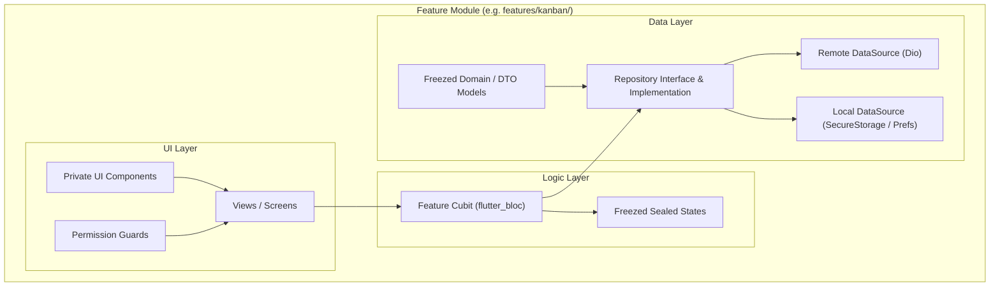
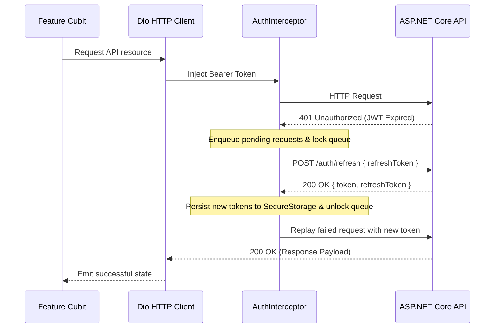
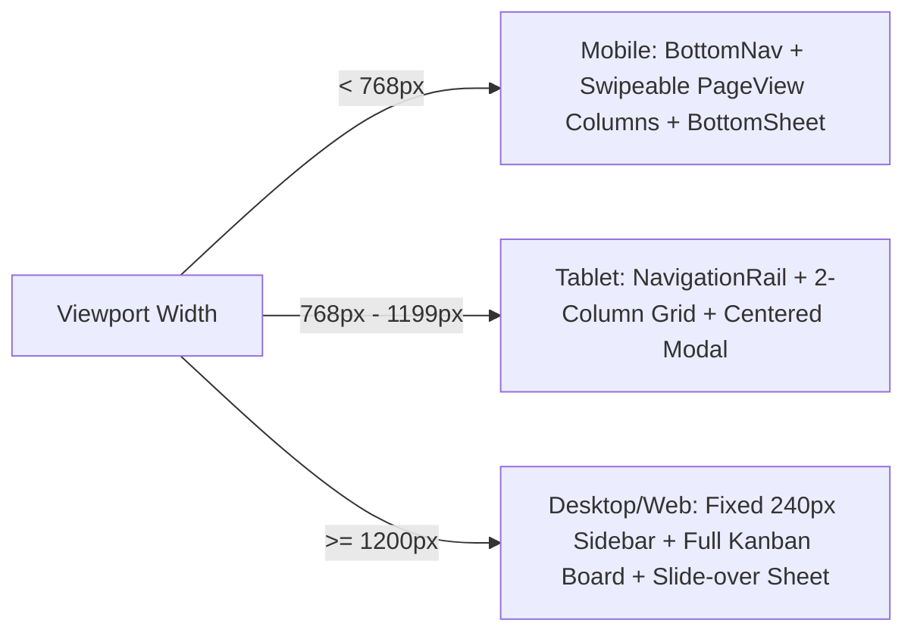

# ProjectHub — Frontend Architecture (Flutter Client)

A technical specification of the Flutter client architecture for **ProjectHub Client** (Mobile & Web).

---

## 1. Architectural Principles

The Flutter client employs a **Feature-First Layered Architecture** with **MVVM + Cubit** state management and the **Repository Pattern**:



---

## 2. Directory Layout & Module Organization

```text
client/
├── assets/
│   ├── fonts/                  # Inter (Regular, Medium, SemiBold, Bold)
│   ├── icons/                  # SVG icons
│   └── images/                 # Onboarding & brand illustrations
├── l10n/
│   ├── app_en.arb              # English localization bundle
│   └── app_ar.arb              # Arabic localization bundle
├── lib/
│   ├── main.dart               # App initialization, native splash & DI setup
│   ├── app.dart                # MaterialApp, AuthGate, theme & routes
│   │
│   ├── core/                   # Cross-cutting foundational services
│   │   ├── constants/          # App constants, API endpoints, storage keys
│   │   ├── di/                 # Dependency injection setup (GetIt + Injectable)
│   │   ├── errors/             # Custom Failure classes & Dio error mapper
│   │   ├── network/            # Resilient Dio client & AuthInterceptor
│   │   ├── routes/             # AppRouter (onGenerateRoute) & RouteNames
│   │   ├── storage/            # FlutterSecureStorage & SharedPreferences
│   │   ├── theme/              # Stitch UI tokens & Material 3 ThemeData
│   │   ├── utils/              # PermissionChecker, date utilities, validators
│   │   └── widgets/            # Reusable UI atoms (buttons, cards, chips, dialogs)
│   │
│   └── features/               # Feature-First Modules
│       ├── splash/             # Startup & token verification
│       ├── onboarding/         # First-launch onboarding carousel
│       ├── auth/               # Login, Register, Profile screens & Cubits
│       ├── workspaces/         # Workspaces list, switcher & member management
│       ├── projects/           # Projects dashboard & project creation
│       └── kanban/             # Kanban board, columns, drag-drop & task sheets
```

---

## 3. Dependency Injection & Service Locator

The application uses **`get_it`** and **`injectable`** for automated dependency registration:

```dart
// lib/core/di/injection.dart
final getIt = GetIt.instance;

@InjectableInit(
  initializerName: 'init',
  preferRelativeImports: true,
  asExtension: true,
)
Future<void> configureDependencies() async => getIt.init();
```

---

## 4. Resilient Network Layer (`AuthInterceptor`)

The network layer provides transparent token refreshing for expired JWT tokens, backed by the server's multi-session rotation model (see [ADR-0005](./adr/0005-multi-session-sha256-refresh-token-rotation.md)):



---

## 5. Responsive UI Strategy & Interactions

The client dynamically switches layout structures across breakpoints (see [ADR-0007](./adr/0007-responsive-kanban-navigation-and-modal-interactions.md)):



### Kanban Board Interactions & Optimistic UI
1. **Mobile (< 768px):** A swipeable `PageView` paired with a segmented column tab bar (`Backlog`, `Todo`, `InProgress`, `Review`, `Done`) avoids nested horizontal/vertical scroll conflicts.
2. **Desktop / Tablet ($\ge$ 768px):** Full multi-column view with horizontal scrolling and side-by-side columns.
3. **Optimistic Column Drag-and-Drop:** Task status changes immediately snap to the target column on UI; a minimal `PATCH /tasks/{id}/status` is fired in the background (see [ADR-0004](./adr/0004-dedicated-patch-endpoints-for-kanban-status-and-assignee.md)). On error, the card rolls back with a feedback SnackBar.
4. **Modals & Fast Actions:** Task creation/editing uses a draggable bottom sheet on mobile and centered modal on desktop. Quick 1-tap popups on assignee avatars and status pills allow immediate in-place updates.

---

## 6. Stitch Design System & Theming

Designed in accordance with Material 3, using custom Stitch UI tokens (see [Design System Specification](./design-system.md)):

- **Foundation Background:** Deep Slate `#0F172A`
- **Surface Elevation:** `#13131B` and Container `#1E293B`
- **Primary Brand:** Indigo `#6366F1`
- **Secondary Accent:** Sky Blue `#38BDF8`
- **Priority Colors:**
  - `Urgent`: Rose `#FB7185`
  - `High`: Coral `#F43F5E`
  - `Medium`: Sky `#38BDF8`
  - `Low`: Slate `#94A3B8`
- **Typography:** Bundled **Inter** font family (`assets/fonts/`) for zero font flicker (FOIT).
