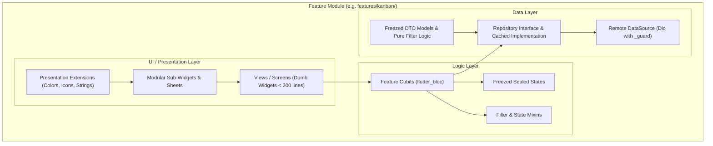
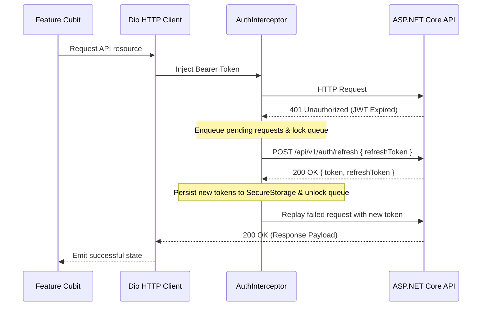
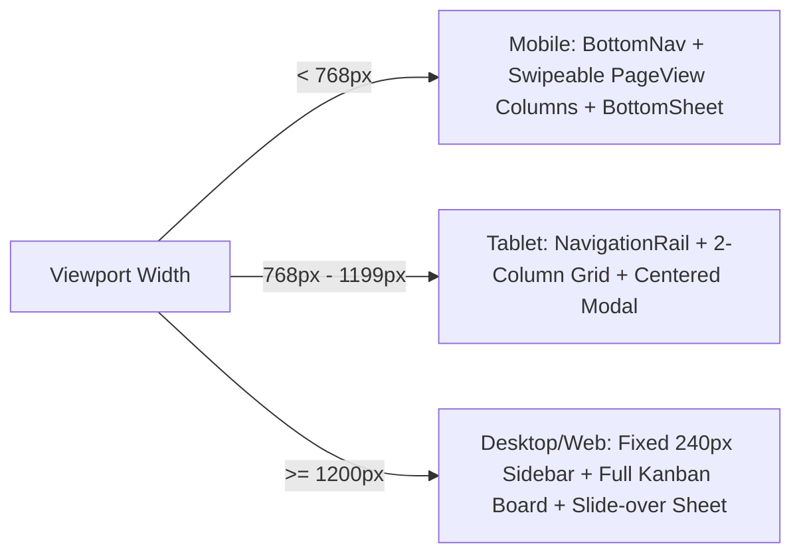

# ProjectHub — Frontend Architecture (Flutter Client)

A technical specification of the Flutter client architecture for **ProjectHub Client** (Mobile & Web).

---

## 1. Architectural Principles

The Flutter client employs a **Clean Feature-First Layered Architecture without a Domain Layer** with **MVVM + Cubit** state management and the **Repository Pattern** (see [ADR-0016](./adr/0016-strict-clean-architecture-without-domain-layer.md)):



---

## 2. Directory Layout & Module Organization

```text
client/
├── assets/
│   ├── fonts/                  # Inter (Regular, Medium, SemiBold, Bold)
│   ├── icons/                  # SVG icons
│   └── images/                 # Onboarding & brand illustrations
├── l10n/
│   ├── app_en.arb              # English localization bundle
│   └── app_ar.arb              # Arabic localization bundle
├── lib/
│   ├── main.dart               # App initialization, native splash & DI setup
│   ├── app.dart                # MaterialApp, AuthGate, theme & routes
│   │
│   ├── core/                   # Cross-cutting foundational services
│   │   ├── constants/          # App constants, API endpoints, storage keys
│   │   ├── di/                 # Dependency injection setup (GetIt + Injectable)
│   │   ├── errors/             # Custom Failure classes & Dio error mapper
│   │   ├── network/            # Resilient Dio client & AuthInterceptor
│   │   ├── routes/             # AppRouter, RouteNames & route_providers.dart
│   │   ├── storage/            # FlutterSecureStorage & SharedPreferences
│   │   ├── theme/              # Stitch UI tokens & Material 3 ThemeData
│   │   ├── utils/              # PermissionChecker, date utilities, validators
│   │   └── widgets/            # Reusable UI atoms (buttons, cards, chips, dialogs)
│   │
│   └── features/               # Feature-First Modules
│       ├── splash/             # Startup & token verification
│       ├── onboarding/         # First-launch onboarding carousel
│       ├── auth/               # Login, Register, Profile screens, Cubits & AuthRepository
│       ├── workspaces/         # Workspaces list, switcher, member management & WorkspaceRepository
│       ├── projects/           # Projects dashboard, project detail & ProjectRepository
│       ├── tasks/              # Task models, TaskRepository, TaskFilter & shared task sheets
│       ├── kanban/             # Kanban board, columns, drag-drop, mobile PageView & KanbanCubit
│       └── dashboard/          # Dashboard screen, sprint focus & activity stream
```

---

## 3. Dependency Injection & Centralized Route Providers

### Service Locator Registration
The application uses **`get_it`** and **`injectable`** for automated singleton and factory registrations:

```dart
// lib/core/di/injection.dart
final getIt = GetIt.instance;

@InjectableInit(
  initializerName: 'init',
  preferRelativeImports: true,
  asExtension: true,
)
Future<void> configureDependencies() async => getIt.init();
```

### Centralized Route Providers (`route_providers.dart`)
All BlocProviders are declared in `client/lib/core/routes/route_providers.dart`. Rather than wrapping the whole application with a monolithic `MultiBlocProvider` above `MaterialApp` (which causes improper disposal, memory leaks, and global state pollution), providers are instantiated lazily per route with proper disposal when routes pop:

```dart
// lib/core/routes/route_providers.dart
Widget buildKanbanRoute(int projectId) => BlocProvider(
  create: (_) => getIt<KanbanCubit>(),
  child: KanbanScreen(projectId: projectId),
);
```

---

## 4. Resilient Network Layer (`AuthInterceptor`)

The network layer provides transparent token refreshing for expired JWT tokens, backed by the server's multi-session rotation model (see [ADR-0005](./adr/0005-multi-session-sha256-refresh-token-rotation.md)):



---

## 5. Responsive UI Strategy & Interactions

The client dynamically switches layout structures across breakpoints (see [ADR-0007](./adr/0007-responsive-kanban-navigation-and-modal-interactions.md)):



### Kanban Board Interactions & Optimistic UI
1. **Mobile (< 768px):** A swipeable `PageView` paired with a segmented column tab bar (`Backlog`, `Todo`, `InProgress`, `Review`, `Done`) avoids nested horizontal/vertical scroll conflicts.
2. **Desktop / Tablet ($\ge$ 768px):** Full multi-column view with horizontal scrolling and side-by-side columns.
3. **Optimistic Column Drag-and-Drop:** Task status changes immediately snap to the target column on UI; a minimal `PATCH /api/v1/tasks/{id}/status` is fired in the background (see [ADR-0004](./adr/0004-dedicated-patch-endpoints-for-kanban-status-and-assignee.md)). On error, the card rolls back with a feedback SnackBar.
4. **Hero Animations & Fast Actions:** Task creation/editing uses a draggable bottom sheet on mobile and centered modal on desktop. Tapping a Kanban card triggers a seamless `Hero` expansion transition into the detail view. Quick 1-tap popups on assignee avatars and status pills allow immediate in-place updates.
5. **Skeleton Loading Consistency:** All list and detail screens utilize `skeletonizer` to ensure flicker-free, skeleton-driven revalidation.

---

## 6. Brand Theme & Workspace-Scoped Accent Colors

Designed in accordance with Material 3, using custom Stitch UI tokens and workspace-level wayfinding colors (see [ADR-0015](./adr/0015-workspace-accent-color-replaces-personal-palette.md)):

- **Locked Brand Identity:** Deep Slate (Electric Violet `#C0C1FF` & Sky Blue `#89CEFF` on Deep Slate `#0F172A` / `#1F1F27`, with calibrated Light theme counterparts).
- **Theme Modes:** Dark, Light, and System (follow device), managed reactively by `AppSettingsCubit` and persisted to `SharedPreferences`.
- **Workspace-Scoped Accent Colors:** 10 vetted high-contrast colors (`teal`, `blue`, `indigo`, `violet`, `pink`, `rose`, `orange`, `amber`, `lime`, `cyan`) managed via `WorkspaceAccent`. Evaluated per theme brightness to guarantee legibility and scoped exclusively to wayfinding touchpoints (switcher pill dot, active sidebar stripe, switcher card indicators).
- **Ambient Glow Background:** Continuous orbital gradient animation permanently locked to the Deep Slate brand colors (`Electric Violet` and `Sky Blue`).
- **Priority Colors:**
  - `Urgent`: Rose `#FB7185`
  - `High`: Coral `#F43F5E`
  - `Medium`: Sky `#38BDF8`
  - `Low`: Slate `#94A3B8`
- **Typography:** Bundled **Inter** font family (`assets/fonts/`) for zero font flicker (FOIT).

---

## 7. Unified Profile & Settings Hub

Accessible at `/profile`, consolidating non-workspace user settings into a single scrollable view:
- **Profile Management Card:** Editable display name, bio, and initials avatar with instant API sync (`PUT /api/v1/users/me`).
- **Appearance Section:** Dark/Light/System theme mode selector.
- **Localization Section:** English 🇬🇧 and Arabic 🇸🇦 language switcher with immediate RTL/LTR adaptation.
- **About & Version Section:** Displays application semantic version and build number via `package_info_plus`.
- **Help Section:** Localized expandable FAQ (`ExpansionTile`) covering workspaces, Kanban rules, and permissions.
- **Account Actions:** Safe logout button clearing secure tokens and resetting application state.

---

## 8. Activity Feed UI Integration

- **Dashboard Feed:** Shows the latest 10 workspace-level events (`GET /api/v1/workspaces/{id}/activity`) with avatar badges, relative timestamps, and event descriptions.
- **Project Activity Tab:** Integrated into the project detail screen (`GET /api/v1/projects/{id}/activity`) showing task movements and lifecycle transitions.

---

## 9. Strict Clean Architecture & 200-Line Modularity

To ensure maintainability, testability, and clarity of boundaries:
1. **Clean Architecture without Domain Overhead**: Features comprise Presentation and Data layers. Domain logic (filtering, ordering) is encapsulated in pure data extensions (`TaskFilter`, `filterProjects`) or repositories.
2. **Dumb UI Widgets**: Screens and widgets contain zero business calculations, no fallback mock repositories, and no direct service lookups. Test doubles are strictly isolated in `test/**/fakes/`.
3. **Separation of Presentation Extensions**: Data models and enums are purely structural. Colors, icons, and localized labels are implemented via presentation layer extensions (`*_ui.dart`).
4. **Strict 200-Line File Limit**: Every source file in `client/lib/` is strictly under 200 lines of code. Large screens, sheets, and forms are decomposed into cohesive child widgets, mixins, and builder helpers.
