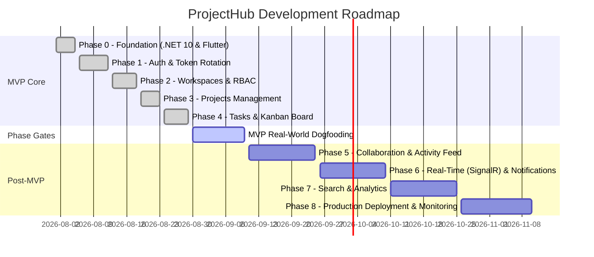

# Product Requirements Document — ProjectHub (Solo-Build Edition)

**Product:** ProjectHub  
**Version:** 1.0 (MVP)  
**Platform:** Flutter Mobile/Web + ASP.NET Core 10 Web API  
**Database:** PostgreSQL  
**Document Status:** Approved & Baseline MVP Implemented  
**Primary Goal:** Build a responsive project management and team collaboration platform, scoped so one developer can ship a working, robustly architected MVP without stalling on premature complexity.

---

## 1. Product Overview

**ProjectHub** is a collaborative project management platform for organizing workspaces, tracking projects, and managing tasks visually from a single application.

- Each user belongs to one or more **workspaces**.
- Each workspace contains **projects**.
- Each project contains **tasks** tracked via a **Kanban board**.

### MVP Core Capabilities
- Create, manage, and switch workspaces
- Direct-add and remove workspace members by email
- Create, manage, archive, and delete projects
- Create, assign, edit, and track tasks
- Move tasks across Kanban status columns (`Backlog`, `Todo`, `In Progress`, `Review`, `Done`)

---

## 2. Product Goals & Non-Goals

### Core Goals
- **G1 — Project Management:** Provide a clean, intuitive structure to organize projects and tasks.
- **G2 — Team Collaboration:** Allow workspace members to collaborate around shared projects.
- **G3 — Visibility & Focus:** Give users clear visibility into task priority, assignments, and due dates.
- **G4 — Solo-Buildable & Maintainable:** Every phase is independently shippable, testable, and maintainable without bloated dependencies.
- **G5 — Production-Quality Patterns:** Adopt clean architectural patterns with strongly-typed contracts, caching, and resilient networking.

### Non-Goals (Out of Scope for MVP)
- Financial management, billing, invoicing, payroll
- Video conferencing or rich in-app document editing
- Complex, custom per-field permission engines
- Premature real-time SignalR before Phase 5/6 gates

---

## 3. Simplified User Roles & Security Boundary

To keep QA lean and maintainable, ProjectHub enforces a streamlined **two-tier role model** at the workspace isolation boundary.

| Permission | Workspace `Owner` | Project / Task Creator (`CreatedBy == userId`) | Task Assignee (`AssigneeId == userId`) | Workspace `Member` |
| :--- | :---: | :---: | :---: | :---: |
| **View Workspace & Members** | ✅ | ✅ | ✅ | ✅ |
| **Edit / Delete Workspace** | ✅ | ❌ | ❌ | ❌ |
| **Invite / Remove Members** | ✅ | ❌ | ❌ | ❌ |
| **Create Project** | ✅ | ✅ | ✅ | ✅ |
| **Edit / Delete Project** | ✅ | ✅ | ❌ | ❌ |
| **Create Task** | ✅ | ✅ | ✅ | ✅ |
| **Move Task Status (Kanban)**| ✅ | ✅ | ✅ | ❌ |
| **Assign / Reassign Task** | ✅ | ✅ | ✅ | ✅ |
| **Delete Task** | ✅ | ✅ | ❌ | ❌ |

---

## 4. Core Features Specification

### 4.1 Authentication & Profile
- **Registration & Login:** Identity-backed account creation with JWT access tokens and refresh tokens.
- **Refresh Token Rotation:** Multi-session refresh tokens with hash verification and token reuse detection.
- **Profile:** User profile retrieval and updates (`Name`, `Bio`, `Email`) with cache invalidation.
- **Password Reset:** Dev-mode reset token generation and verification endpoints.

### 4.2 Workspaces
- **Attributes:** `Id`, `Name`, `Description`, `CreatedAt`, `UpdatedAt`.
- **Operations:** Create workspace (creator automatically becomes `Owner`), update name/description, delete workspace (cascades cleanly).
- **Membership:** Direct add by email, remove member (with automatic task unassignment for removed users).

### 4.3 Projects
- **Attributes:** `Id`, `WorkspaceId`, `Name`, `Description`, `Status` (`Planning`, `Active`, `Completed`, `Archived`), `DueDate`, `CreatedBy`, `CreatedAt`, `UpdatedAt`.
- **Operations:** Create project, update details, delete project, filter projects by status.

### 4.4 Tasks & Kanban Board
- **Attributes:** `Id`, `ProjectId`, `Title`, `Description`, `Status` (`Backlog`, `Todo`, `InProgress`, `Review`, `Done`), `Priority` (`Low`, `Medium`, `High`, `Urgent`), `AssigneeId`, `CreatedBy`, `DueDate`, `CreatedAt`, `UpdatedAt`.
- **Operations:** Create task, update details, delete task, filter by status / assignee / priority.
- **Dedicated Kanban PATCH Endpoints:**
  - `PATCH /tasks/{id}/status` for status changes (drag-and-drop / column moves).
  - `PATCH /tasks/{id}/assignee` for assigning tasks to workspace members.

---

## 5. Development Phases & Roadmap

---

## 6. Phase Gates for Post-MVP Features

To avoid scope creep, subsequent phases have strict stability criteria:

1. **Phase 5 (Collaboration):** Requires using the Kanban board for day-to-day task tracking for at least two weeks with zero data loss or synchronization anomalies.
2. **Phase 6 (Real-Time SignalR):** SignalR will only be added after offline/silent refresh resilience and REST API correctness are established in production.

