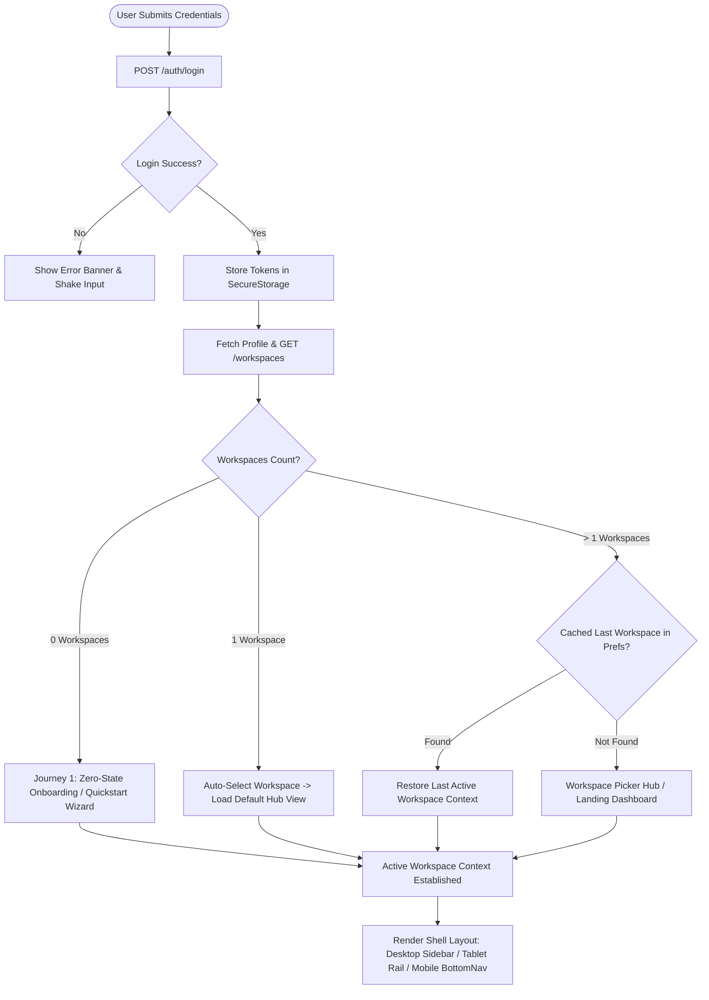
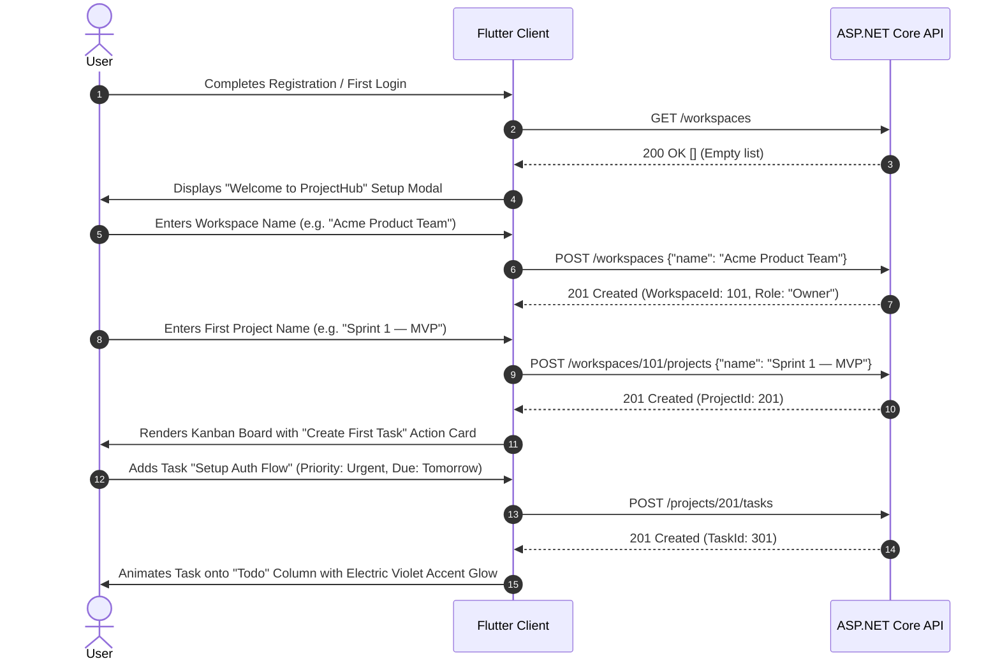
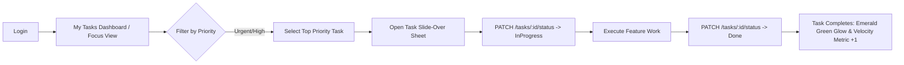
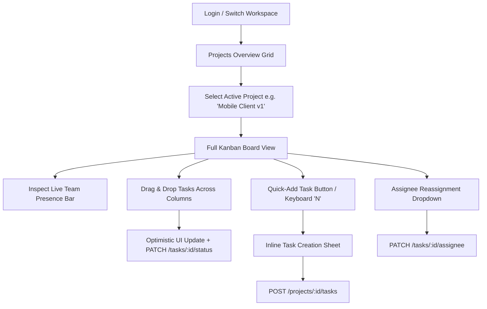
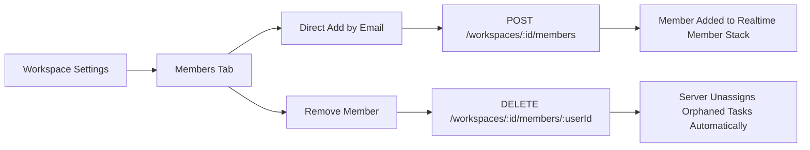

# ProjectHub — Post-Login User Flows & Workflows

A comprehensive specification of **post-login user journeys, information architecture, navigation models, and state flows** for the **ProjectHub** application (Flutter Mobile/Web & ASP.NET Core 10 Web API).

---

## 1. Post-Login Routing & Context Decision Engine

Immediately upon successful authentication (`POST /auth/login` or `POST /auth/register`), the client stores access and refresh tokens in `SecureStorage` and executes the startup context discovery flow:



### Automatic Context Resolution Rules
1. **Zero Workspaces:** Prompt the user with a streamlined 2-step setup modal (`Create Workspace` $\rightarrow$ `Create First Project`) to eliminate empty-screen confusion.
2. **Single Workspace:** Automatically set it as the active workspace in session memory and `PrefsService`, navigating directly into the workspace's primary view.
3. **Multiple Workspaces:** Check `PrefsService` for `last_active_workspace_id`. If valid and the user is still a member, restore that context immediately. Otherwise, display the **Workspace Switcher Hub**.

---

## 2. User Archetypes & Intent Profiles

Post-login screens and navigation adapt dynamically to user roles and intent profiles:

| Persona | Primary Goal | First Action After Login | Top Needs | Security / RBAC Boundary |
| :--- | :--- | :--- | :--- | :--- |
| **New User (First-Time)** | Get oriented quickly & set up work | Create first workspace & project | Low-friction wizard, starter task checklist, clear primary CTA | Workspace `Owner` |
| **Individual Contributor (Doer / Dev)** | Execute assigned work without distraction | Open **"My Tasks"** / Assigned sprint backlog | Quick status toggles, clear priority badges, due-date warnings | Workspace `Member` (`AssigneeId == userId`) |
| **Project Lead / Scrum Master** | Monitor sprint health & unblock team | Open **Kanban Board** & check team progress | Drag-and-drop status moves, assignee reassignment, team presence | Workspace `Member` or `Owner` (`CreatedBy == userId`) |
| **Workspace Owner (Admin)** | Governance, team expansion, milestones | Check project health & manage members | Member email invitations, project archiving, workspace settings | Workspace `Owner` (Full privileges) |

---

## 3. Step-by-Step User Journeys

---

### Journey 1: The "Zero-to-One" Bootstrap (First-Time User)
> **Objective:** Guide a newly registered user from an empty account to their first interactive Kanban task in $<60$ seconds.



* **Key UX & Delight Details:**
  * Minimal cognitive load: Single frosted card (`VisualCanvasCard`) with 2 concise steps.
  * Instant feedback with local optimistic rendering.
  * Optional prompt: *"Invite your team members via email to collaborate in real-time."*

---

### Journey 2: The "Daily Standup & Focus" Journey (Individual Contributor)
> **Objective:** A developer logs in to review assigned tasks, triage blockers, and move active items to completion.



* **Step-by-step Flow:**
  1. **Landing:** Quick-switch to **"My Tasks"** (aggregating tasks across all workspace projects where `AssigneeId == currentUserId`).
  2. **Triage:** Tasks are grouped into semantic urgency categories:
     - 🚨 *Urgent / Overdue* (`#FB7185` badge)
     - ⚡ *In Progress* (`#89CEFF` badge)
     - 📋 *Up Next in Todo* (`#C0C1FF` badge)
  3. **Task Inspection:** Clicking a card opens the **Task Slide-Over Sheet** (Desktop) or **Bottom Sheet** (Mobile).
  4. **Status Progression:** One-tap status transition from `Todo` $\rightarrow$ `In Progress` (`PATCH /tasks/{id}/status`).
  5. **Completion:** Mark `Done` $\rightarrow$ triggers card confetti / green border animation (`#22C55E`) and updates velocity counters.

---

### Journey 3: The "Sprint & Kanban Orchestration" Journey (Project Lead)
> **Objective:** Coordinate team deliverables, reassign tasks, and resolve pipeline bottlenecks.



* **Key UX Features:**
  * **5 Kanban Columns:** `Backlog` $\rightarrow$ `Todo` $\rightarrow$ `In Progress` $\rightarrow$ `Review` $\rightarrow$ `Done`.
  * **Multi-Filter Bar:** Instant real-time filtering by Assignee avatar chip, Priority pill, and search keywords.
  * **Presence Indicators:** Top banner displaying active team avatars with a pulsing green connection indicator (`#22C55E`).

---

### Journey 4: The "Workspace Governance & Team Management" Journey (Owner)
> **Objective:** Add team members, control access boundaries, and manage project lifecycles.



* **Security & Governance Invariants:**
  * Only users with `WorkspaceMember.Role == "Owner"` have access to rename/delete workspaces, remove members, or edit workspace settings.
  * Removing a member automatically sets `AssigneeId = null` on all tasks assigned to that user in that workspace, preventing broken references.

---

### Journey 5: Multi-Workspace Context Switching
> **Objective:** Enable frictionless context switching for users collaborating across multiple organizations or departments.

1. User clicks the **Workspace Selector** in the top navigation bar or sidebar.
2. Dropdown displays all joined workspaces with role pills (`Owner` or `Member`).
3. User selects target workspace $\rightarrow$ Client updates `activeWorkspaceId`, saves to `PrefsService`, clears previous project cache, and fetches projects for the new workspace via `GET /api/v1/workspaces/{id}/projects`.

---

### Journey 6: The "Personalization & Workspace Styling" Journey
> **Objective:** Allow users to manage appearance mode and language, while workspace owners customize workspace wayfinding colors.

1. User navigates to **Profile & Settings** (`/profile` via sidebar, bottom nav, or top avatar).
2. **Profile Card:** User inspects current details, edits name/bio, and taps Save $\rightarrow$ fires `PUT /api/v1/users/me` with optimistic update and feedback banner.
3. **Appearance & Brand Theme:**
   - User toggles between Dark, Light, or System theme mode. The application remains consistently styled with the signature Deep Slate brand aesthetic (Electric Violet & Sky Blue) and continuous orbital ambient glow.
4. **Workspace Wayfinding Accent (Owner Flow):**
   - Workspace owners navigate to Workspace Settings (`/workspaces`), where an inline accent picker allows choosing from 10 vetted accent colors (`teal`, `blue`, `indigo`, `violet`, `pink`, `rose`, `orange`, `amber`, `lime`, `cyan`).
   - Tapping Save updates `WorkSpace.AccentColor` via `PUT /api/v1/workspaces/{id}`, immediately synchronizing wayfinding indicators across the top bar switcher pill, sidebar active stripe, and workspace switcher cards for all members.
5. **Language Selection:** User switches between English 🇬🇧 and Arabic 🇸🇦 $\rightarrow$ app dynamically updates locale and text direction (LTR/RTL) without restart.
6. **Help & Support:** User explores the FAQ section with expandable `ExpansionTile` accordions covering workspaces, projects, Kanban shortcuts, and roles.
7. **About App:** User reviews semantic app version and build number.

---

### Journey 7: The "Activity & Audit Stream" Discovery Journey
> **Objective:** Keep teams informed about workspace movements, task assignments, and project status evolutions.

1. **Workspace Overview Feed:** Navigating to Dashboard displays the **Recent Activity** card populated from `GET /api/v1/workspaces/{id}/activity`, featuring actor avatars, time-ago chips, and clear mutation descriptions.
2. **Project History Feed:** Opening a project's detail view allows switching to the **Activity** tab (`GET /api/v1/projects/{id}/activity`) to inspect granular task transitions, moves to `Done`, and assignment changes.

---

## 4. Information Architecture & Navigation Framework

The application follows a **responsive shell architecture** that adapts to three standard viewport classes:

```
┌─────────────────────────────────────────────────────────────────────────────┐
│  APP SHELL (AmbientGlowBackground with Deep Slate Brand Orbital Shader)      │
├──────────────┬──────────────────────────────────────────────────────────────┤
│ SIDEBAR      │ TOP HEADER                                                   │
│ (240px Fixed │ [Workspace Switcher ▾ (Accent Dot)] [🔍 Search] [👥 Stack] [👤]│
│ on Desktop / ├──────────────────────────────────────────────────────────────┤
│ Drawer on    │ MAIN CONTENT VIEWPORT                                        │
│ Mobile)      │                                                              │
│ [Active WS   │ 1. 📊 Dashboard / Overview                                   │
│  Accent      │    - Real project & task summary counts                      │
│  Stripe]     │    - Priority task breakdown                                 │
│ 🏢 Workspace │    - Workspace Activity Feed                                 │
│ 📋 My Tasks  │                                                              │
│ 📁 Projects  │ 2. 🗂 Project Kanban Board                                    │
│    ├─ Client │    [Backlog]  [Todo]  [In Progress]  [Review]  [Done]        │
│    └─ API    │                                                              │
│ 👥 Members   │ 3. 👤 Profile & Settings Hub (/profile)                      │
│              │    - Edit Name & Bio                                         │
│ 👤 Profile & │    - Theme Mode (Dark/Light/System)                          │
│    Settings  │    - Language Picker & FAQ & Version                         │
│ 🚪 Logout    │                                                              │
└──────────────┴──────────────────────────────────────────────────────────────┘
```

### Responsive Layout Matrix

| Breakpoint | Navigation Pattern | Kanban Board View | Task Detail Modal |
| :--- | :--- | :--- | :--- |
| **Mobile (`< 768px`)** | Bottom Navigation Bar (*Dashboard, Projects, My Tasks, Profile*) | Swipeable horizontal `PageView` (1 column visible at a time with page indicator dots) | Modal Bottom Sheet with Hero expansion |
| **Tablet (`768px – 1199px`)** | Collapsible Left Navigation Rail (icon rail with expandable tooltips) | Scrollable 5-column horizontal board with compact task cards | Centered Glassmorphism Dialog |
| **Desktop / Web (`>= 1200px`)** | Persistent 240px Sidebar with collapsible project tree & member stack | Full-width multi-column Kanban board with drag-and-drop | Right-side Slide-Over Sheet (keeps board visible) |

---

## 5. Client Route Hierarchy (`RouteNames`)

The structured routing tree in `AppRouter` supporting all post-login flows:

```dart
abstract class RouteNames {
  // Public & Authentication
  static const String onboarding = '/onboarding';
  static const String login = '/login';
  static const String register = '/register';
  static const String forgotPassword = '/forgot-password';
  static const String resetPassword = '/reset-password';

  // Authenticated App Shell & Core Navigation
  static const String shell = '/';                         // Main Responsive Shell
  static const String workspaces = '/workspaces';           // Workspace Settings & Members
  static const String dashboard = '/dashboard';             // Global Metrics & Activity Feed
  static const String myTasks = '/my-tasks';               // Aggregated User Tasks

  // Projects & Kanban
  static const String projects = '/projects';               // Project Grid in Active Workspace
  static const String projectDetail = '/project-detail';    // Project Overview, Tasks & Activity Tab
  static const String kanban = '/kanban';                   // Interactive 5-Column Kanban Board

  // Unified User & Settings Hub
  static const String profile = '/profile';                 // Profile Edit, Theming, Language, FAQ
}
```

---

## 6. Resilience & Edge Cases in Post-Login Flows

1. **Silent Token Refresh During Long Sessions:**
   - If the access token expires while moving tasks on a Kanban board, `AuthInterceptor` pauses outbound requests, rotates the refresh token via `POST /api/v1/auth/refresh`, updates `SecureStorage`, and replays the original requests transparently with zero UI interruption.
2. **Network Disconnection During Task Drag-and-Drop:**
   - The UI optimistically updates the task card's column. If `PATCH /api/v1/tasks/{id}/status` returns a network error or timeout, the card smoothly animates back to its previous column and displays a transient error toast.
3. **Workspace Access Revocation:**
   - If the user is removed from a workspace while actively viewing it, subsequent API calls return `403 Forbidden` or `404 Not Found`. The app traps the error, invalidates the active workspace cache, and routes the user back to their next available workspace or the **Zero-State Onboarding** screen.
4. **Direct-Link Deep Linking:**
   - When a user opens a direct URL (e.g. `/kanban` with arguments), `AuthGate` checks authentication state. If valid, it verifies membership for the project's parent workspace, sets the workspace as active, and renders the Kanban board directly.

