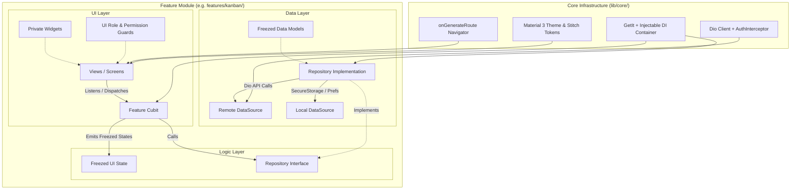
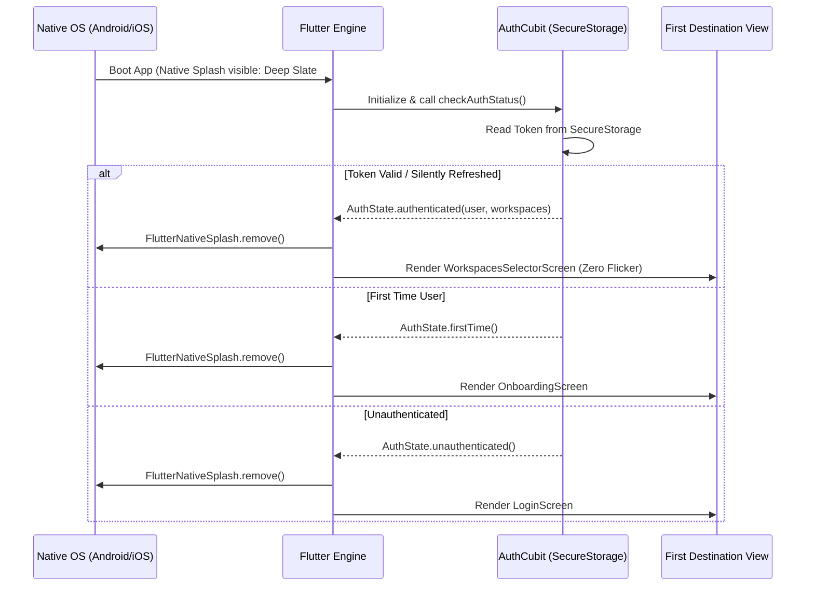
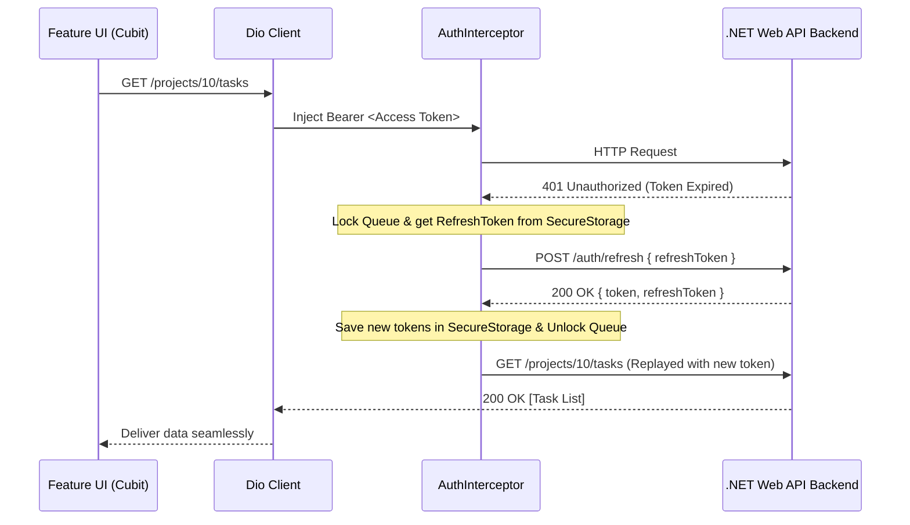

# ProjectHub Client — Frontend Architecture & Technical Specification

> **Portfolio Edition:** A responsive Flutter Client (Mobile + Web) featuring Feature-First MVVM + Cubit, Repository Pattern, Injectable + GetIt, Freezed Immutable Models, Dio Resilient Networking, Local Font Bundling, and Material 3 Dark/Light Theming derived from Stitch UI.
> **Portfolio Edition:** A responsive Flutter Client (Mobile + Web) featuring Feature-First MVVM + Cubit, Repository Pattern, Role-Based UI Guards (Owner/Member), Native Splash (`flutter_native_splash`), Injectable + GetIt, Freezed Immutable Models, Dio Resilient Networking, Local Font Bundling, and Material 3 Dark/Light Theming derived from Stitch UI.

---

## 1. Architectural Blueprint

The client employs a **Feature-First Layered Architecture** with the **Repository Pattern** and **Cubit** state management, eliminating the ceremonial boilerplate of dedicated Use Cases while preserving strict separation between UI, state, and networking.
The client employs a **Feature-First Layered Architecture** with the **Repository Pattern** and **Cubit** state management.



---

## 2. Feature-First Directory Structure
## 2. Role-Based UI Authorization Matrix (Owner vs Member)

The client uses strongly-typed permission helpers (`core/utils/permission_checker.dart`) to conditionally render and guard action buttons (edit, delete, invite, remove) matching the backend security model:

| Resource | Action | Workspace `Owner` | Creator (`CreatedBy == userId`) | Assignee (`AssigneeId == userId`) | Regular `Member` |
| :--- | :--- | :---: | :---: | :---: | :---: |
| **Workspace** | View workspace & members | ✅ | ✅ | N/A | ✅ |
| | Edit / Delete workspace | ✅ | ❌ | N/A | ❌ |
| | Direct Add Member by email | ✅ | ❌ | N/A | ❌ |
| | Remove Member | ✅ | ❌ | N/A | ❌ |
| **Projects** | View projects & Kanban board | ✅ | ✅ | N/A | ✅ |
| | Create Project | ✅ | ✅ | N/A | ✅ |
| | Edit Project metadata | ✅ | ✅ | N/A | ❌ |
| | Delete Project | ✅ | ✅ | N/A | ❌ |
| **Tasks** | View tasks & filter | ✅ | ✅ | ✅ | ✅ |
| | Create Task | ✅ | ✅ | ✅ | ✅ |
| | Edit Task / Move Status | ✅ | ✅ | ✅ | ❌ |
| | Assign / Reassign Task | ✅ | ✅ | ✅ | ✅ |
| | Delete Task | ✅ | ✅ | ❌ | ❌ |

```dart
// core/utils/permission_checker.dart
class PermissionChecker {
  static bool canManageWorkspace(WorkspaceRole role) => role == WorkspaceRole.owner;

  static bool canEditProject({required WorkspaceRole role, required String projectCreatorId, required String currentUserId}) =>
      role == WorkspaceRole.owner || projectCreatorId == currentUserId;

  static bool canDeleteProject({required WorkspaceRole role, required String projectCreatorId, required String currentUserId}) =>
      role == WorkspaceRole.owner || projectCreatorId == currentUserId;

  static bool canEditTask({required WorkspaceRole role, required TaskItem task, required String currentUserId}) =>
      role == WorkspaceRole.owner || task.createdBy == currentUserId || task.assigneeId == currentUserId;

  static bool canDeleteTask({required WorkspaceRole role, required TaskItem task, required String currentUserId}) =>
      role == WorkspaceRole.owner || task.createdBy == currentUserId;
}
```

---

## 3. Startup Flow: Native Splash + Seamless Auth Gate

Instead of an artificial Flutter splash widget, the application uses **`flutter_native_splash`** for instant native OS boot, paired with an **`AuthGate`** at the root of `app.dart`:



---

## 4. Feature-First Directory Structure

```text
ProjectHub.Client/
├── assets/
│   ├── fonts/               # Bundled Inter fonts (Regular, Medium, SemiBold, Bold)
│   ├── icons/               # SVG icons
│   └── images/              # Onboarding & branding illustrations
│   └── images/              # Onboarding illustrations (generated via Nano Banana)
├── l10n/
│   ├── app_en.arb           # English translations
│   └── app_ar.arb           # Arabic translations
├── lib/
│   ├── main.dart            # Entrypoint & async dependency setup (configureDependencies)
│   ├── app.dart             # MaterialApp with onGenerateRoute, themes, and l10n
│   ├── main.dart            # Entrypoint, native splash preserve & configureDependencies
│   ├── app.dart             # MaterialApp with onGenerateRoute, AuthGate, themes, l10n
│   │
│   ├── core/                # Shared cross-cutting modules
│   │   ├── constants/       # API endpoints, storage keys, app constants
│   │   ├── di/              # GetIt + Injectable setup (injection.dart, injection.config.dart)
│   │   ├── di/              # GetIt + Injectable (injection.dart, injection.config.dart)
│   │   ├── errors/          # Custom AppExceptions, Failure classes, Dio error mapper
│   │   ├── network/         # Dio client, AuthInterceptor (automatic token refresh queue)
│   │   ├── routes/          # AppRouter (onGenerateRoute), RouteNames, RouteTransitions
│   │   ├── storage/         # FlutterSecureStorage (tokens) & SharedPreferences wrappers
│   │   ├── theme/           # Stitch color tokens, typography, dark/light ThemeData
│   │   ├── utils/           # Date formatters, input validators, responsive helper
│   │   ├── utils/           # PermissionChecker, date formatters, validators, responsive helper
│   │   └── widgets/         # Shared UI atoms/molecules (buttons, inputs, glass cards, chips)
│   │
│   └── features/            # Feature-First Modules
│       ├── splash/
│       │   ├── cubit/       # SplashCubit, SplashState
│       │   └── ui/          # SplashScreen
│       │
│       ├── onboarding/
│       │   ├── cubit/       # OnboardingCubit
│       │   └── ui/          # OnboardingScreen, OnboardingPageView, PageIndicator
│       │
│       ├── auth/
│       │   ├── data/        # AuthRemoteDataSource, AuthRepository, UserModel, TokenModel
│       │   ├── cubit/       # AuthCubit, AuthState
│       │   └── ui/          # LoginScreen, RegisterScreen, ProfileScreen
│       │   └── ui/          # AuthGate, LoginScreen, RegisterScreen, ProfileScreen
│       │
│       ├── workspaces/
│       │   ├── data/        # WorkspaceDataSource, WorkspaceRepository, WorkspaceModel
│       │   ├── cubit/       # WorkspaceCubit, WorkspaceState
│       │   └── ui/          # WorkspaceSelectorScreen, WorkspaceSettingsModal
│       │
│       ├── projects/
│       │   ├── data/        # ProjectDataSource, ProjectRepository, ProjectModel
│       │   ├── cubit/       # ProjectCubit, ProjectState
│       │   └── ui/          # ProjectsDashboardScreen, CreateProjectModal
│       │
│       └── kanban/
│           ├── data/        # TaskDataSource, TaskRepository, TaskModel
│           ├── cubit/       # KanbanCubit, KanbanState, TaskDetailCubit
│           └── ui/
│               ├── kanban_screen.dart           # Responsive container (Mobile vs Web)
│               ├── mobile/                      # Mobile tab/carousel Kanban layout
│               ├── mobile/                      # Mobile swipeable Kanban column layout
│               ├── web/                         # Multi-column widescreen Kanban layout
│               └── widgets/                     # KanbanColumn, TaskCard, TaskDetailSideSheet
│
└── pubspec.yaml
```

---

## 3. Technology Stack & Key Dependencies
## 5. Technology Stack & Key Dependencies

| Category | Package | Justification |
| :--- | :--- | :--- |
| **Native Splash** | `flutter_native_splash` | Native zero-flicker OS splash screen configured with `#0F172A` and app icon. |
| **State Management** | `flutter_bloc` | Fast, testable, predictable Cubits with sealed states. |
| **Immutability & Codegen**| `freezed`, `freezed_annotation` | Pattern-matching union states, immutable models with `copyWith`. |
| **JSON Serialization** | `json_serializable`, `json_annotation` | Generated type-safe JSON converters via `build_runner`. |
| **Dependency Injection** | `get_it`, `injectable` | Automated `@injectable` & `@lazySingleton` dependency wiring. |
| **Networking** | `dio` | Silent token refresh queue on 401, timeout policies, interceptors. |
| **Storage & Security** | `flutter_secure_storage`, `shared_preferences` | Keychain/Keystore for JWT tokens; prefs for theme and active workspace. |
| **Animations** | `flutter_animate` | High-performance staggered cards, glowing pulses, fade transitions. |
| **Localization** | `flutter_localizations`, `intl` | Official Flutter `.arb` multi-language support (English & Arabic). |

---

## 4. Resilient Network Layer (Dio + Refresh Queue)
## 6. Resilient Network Layer (Dio + Refresh Queue)

`AuthInterceptor` catches `401 Unauthorized` responses during active sessions, halts incoming traffic in a queue, executes a single silent `POST /auth/refresh`, updates secure storage, and replays failed requests without user disruption:
`AuthInterceptor` catches `401 Unauthorized` responses during active sessions, halts incoming traffic in a queue, executes a single silent `POST /auth/refresh`, updates secure storage, and replays failed requests without user disruption.



---

## 5. Navigation Architecture (`onGenerateRoute`)
## 7. Responsive Mobile + Web Architecture

Routing is managed via `core/routes/app_router.dart` using standard Flutter `Navigator`:

```dart
class Routes {
  static const String splash = '/';
  static const String onboarding = '/onboarding';
  static const String login = '/login';
  static const String register = '/register';
  static const String workspaces = '/workspaces';
  static const String projects = '/projects';
  static const String kanban = '/kanban';
  static const String profile = '/profile';
}

class AppRouter {
  static Route<dynamic>? onGenerateRoute(RouteSettings settings) {
    switch (settings.name) {
      case Routes.splash:
        return MaterialPageRoute(builder: (_) => const SplashScreen());
      case Routes.onboarding:
        return PageRouteBuilder(
          pageBuilder: (_, __, ___) => const OnboardingScreen(),
          transitionsBuilder: (_, a, __, c) => FadeTransition(opacity: a, child: c),
        );
      case Routes.login:
        return MaterialPageRoute(builder: (_) => const LoginScreen());
      case Routes.kanban:
        final args = settings.arguments as KanbanScreenArgs;
        return MaterialPageRoute(
          builder: (_) => KanbanScreen(projectId: args.projectId, workspaceId: args.workspaceId),
        );
      default:
        return MaterialPageRoute(builder: (_) => const NotFoundScreen());
    }
  }
}
```

---

## 6. Responsive Mobile + Web Architecture

The client adapts dynamically to screen width using responsive breakout widgets:

```dart
class ResponsiveLayout extends StatelessWidget {
  const ResponsiveLayout({
    super.key,
    required this.mobile,
    required this.desktop,
    this.tablet,
  });

  final Widget mobile;
  final Widget desktop;
  final Widget? tablet;

  static bool isMobile(BuildContext context) => MediaQuery.sizeOf(context).width < 768;
  static bool isTablet(BuildContext context) => MediaQuery.sizeOf(context).width >= 768 && MediaQuery.sizeOf(context).width < 1200;
  static bool isDesktop(BuildContext context) => MediaQuery.sizeOf(context).width >= 1200;

  @override
  Widget build(BuildContext context) {
    if (isDesktop(context)) return desktop;
    if (isTablet(context)) return tablet ?? desktop;
    return mobile;
  }
}
```

- **On Mobile (< 768px):** Bottom navigation bar, horizontal swipeable Kanban column pages, bottom sheet task details.
- **On Mobile (< 768px):** Bottom navigation bar, swipeable column PageView, bottom-sheet task details.
- **On Desktop/Web ($\ge$ 1200px):** 240px fixed left sidebar, widescreen multi-column Kanban board, 480px slide-over task side-sheet.

---

## 7. Design System & Stitch Token Mapping
## 8. Design System & Stitch Token Mapping

Direct mapping from Stitch UI tokens to Material 3 with bundled **Inter** typography:

```dart
class AppColors {
  // Deep Slate Foundation
  static const Color background = Color(0xFF0F172A);
  static const Color surface = Color(0xFF13131B);
  static const Color surfaceContainer = Color(0xFF1E293B);
  static const Color surfaceContainerHigh = Color(0xFF292932);
  static const Color border = Color(0xFF334155);

  // Accents
  static const Color primary = Color(0xFF6366F1); // Indigo
  static const Color primaryContainer = Color(0xFF8083FF);
  static const Color secondary = Color(0xFF38BDF8); // Sky Blue

  // Priority Tokens
  static const Color priorityUrgent = Color(0xFFFB7185); // Rose
  static const Color priorityHigh = Color(0xFFF43F5E);   // Coral
  static const Color priorityMedium = Color(0xFF38BDF8); // Sky
  static const Color priorityLow = Color(0xFF94A3B8);    // Slate
}
```

---

## 8. Portfolio Quality Checklist

- [ ] **Feature Cohesion:** Each feature folder is self-contained with its own data, cubits, and UI.
- [ ] **Automated DI:** `injectable` handles all registrations with `@InjectableInit`.
- [ ] **Immutable States:** All UI states and models use `@freezed`.
- [ ] **Offline & Zero FOIT:** Inter fonts bundled locally in `assets/fonts/`.
- [ ] **Full Responsiveness:** Seamless layout adaptation from mobile screens to widescreen Web dashboards.
- [ ] **Full i18n:** English and Arabic translations in `.arb` files.

