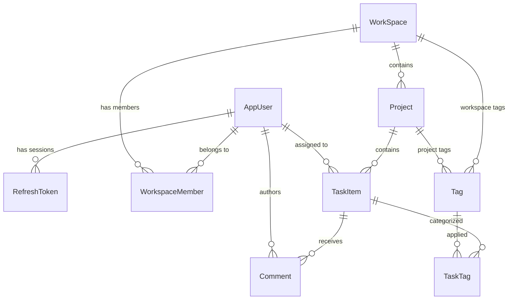

# ProjectHub Backend — ASP.NET Core Web API

Production-ready RESTful Web API for **ProjectHub**, built with **ASP.NET Core 10**, **PostgreSQL (EF Core)**, **ASP.NET Core Identity**, and **JWT Bearer Authentication** with refresh token rotation.

---

## 📋 Table of Contents

- [Overview](#-overview)
- [Tech Stack & Dependencies](#-tech-stack--dependencies)
- [Architecture & Folder Structure](#-architecture--folder-structure)
- [Domain Model & Entity Relationships](#-domain-model--entity-relationships)
- [Security & Authorization](#-security--authorization)
- [Configuration & Environment Variables](#-configuration--environment-variables)
- [Database Setup & Migrations](#-database-setup--migrations)
- [API Endpoints Reference](#-api-endpoints-reference)
- [Caching Strategy](#-caching-strategy)
- [Error Handling & Logging](#-error-handling--logging)
- [Local Development & Running](#-local-development--running)
- [Testing & Verification](#-testing--verification)

---

## 🌟 Overview

The **ProjectHub.Api** backend provides the core domain logic, persistence, real-time push synchronization, and REST endpoints for multi-workspace collaboration, project tracking, and Kanban task management. It enforces a strict **two-tier role model** (`Owner` vs `Member`), multi-session token rotation, distributed Redis caching with .NET 10 `HybridCache`, real-time **SignalR** synchronization with Redis pub/sub backplane, atomic task creation with dual-scope tag validation, PostgreSQL `smallint` enum storage, and centralized middleware-driven error handling.

---

## 🛠 Tech Stack & Dependencies

| Category | Technology / Package | Purpose |
| :--- | :--- | :--- |
| **Framework** | .NET 10.0 (`net10.0`) | Modern, high-performance C# runtime & Web API framework |
| **Real-Time Engine** | `Microsoft.AspNetCore.SignalR` + `StackExchange.Redis` | Bidirectional push synchronization & presence backplane |
| **Database** | PostgreSQL + `Npgsql.EntityFrameworkCore.PostgreSQL` | Relational storage & EF Core provider with smallint enums |
| **Identity & Auth** | `Microsoft.AspNetCore.Identity.EntityFrameworkCore` | User store, password hashing, and token providers |
| **Authentication** | `Microsoft.AspNetCore.Authentication.JwtBearer` | Stateless JWT verification for API & WebSocket requests |
| **Caching** | `Microsoft.Extensions.Caching.Hybrid` + `StackExchangeRedis` | Two-level caching (L1 in-memory + L2 distributed Redis) with L1 fallback |
| **Validation** | `FluentValidation.AspNetCore` | Strongly typed DTO validation rules & pre-save tag validation |
| **Mapping** | `AutoMapper` | Clean entity-to-DTO and DTO-to-entity mapping |
| **Logging** | `Serilog.AspNetCore` + Sinks (Console, File) | Structured JSON logging with daily rolling logs |
| **API Docs** | `Swashbuckle.AspNetCore` + `Microsoft.AspNetCore.OpenApi` | Swagger UI & OpenAPI v1 specification |

---

## 🏗 Architecture & Folder Structure

The server follows a pragmatic, layered structure designed to scale cleanly:

```text
server/
├── ProjectHub.Api.sln                  # Visual Studio / .NET Solution
└── ProjectHub.Api/
    ├── Controllers/                    # REST API Controllers (thin endpoints)
    │   ├── AuthController.cs           # Authentication & password reset
    │   ├── CommentsController.cs       # Task comments CRUD
    │   ├── HealthController.cs         # Observable diagnostic health check (Healthy/Degraded/Unhealthy)
    │   ├── ProjectsController.cs       # Projects CRUD & project tasks
    │   ├── TagsController.cs           # Dual-scope tags management & attachment
    │   ├── TasksController.cs          # Tasks CRUD, Kanban status & assignee PATCH
    │   ├── UsersController.cs          # User profile management & caching
    │   └── WorkspacesController.cs     # Workspaces, member management & role promotion/demotion
    ├── Data/
    │   └── AppDbContext.cs             # EF Core DbContext, Identity config, relationships & smallint enums
    ├── DTOs/                           # Data Transfer Objects
    │   ├── AuthDtos/                   # Register, Login, Refresh, Password reset DTOs
    │   ├── CommentDtos/                # Comment request/response DTOs
    │   ├── ProjectDtos/                # Project request/response DTOs
    │   ├── TagDtos/                    # Dual-scope tag request/response DTOs
    │   ├── TaskDtos/                   # Task request/response DTOs with tagIds
    │   └── WorkSpaceDtos/              # Workspace & member role DTOs
    ├── Exceptions/
    │   └── ForbiddenException.cs       # Custom 403 Forbidden domain exception
    ├── Extensions/
    │   ├── ClaimsPrincipalExtensions.cs # Claims helper (User.GetUserId())
    │   └── TaskEnumExtensions.cs       # Conversion between smallint enums and wire strings
    ├── Hubs/
    │   └── WorkspaceHub.cs             # SignalR real-time push synchronization & online presence hub
    ├── Middlewares/
    │   └── ExceptionHandlingMiddleware.cs # Global error handler & ApiErrorResponse formatter
    ├── Migrations/                     # EF Core migration history
    ├── Models/                         # Domain Entities & Enums
    │   ├── AppUser.cs                  # Identity user entity (Name, Bio)
    │   ├── Comment.cs                  # Flat chronological task comments
    │   ├── RefreshToken.cs             # Multi-session hashed refresh tokens
    │   ├── Tag.cs                      # Workspace & project scoped tags
    │   ├── TaskTag.cs                  # Many-to-many join entity
    │   ├── WorkSpace.cs                # Workspace aggregate root
    │   ├── WorkspaceMember.cs          # Workspace membership & role join entity
    │   ├── WorkspaceRoles.cs           # Roles: Owner, Member
    │   ├── Project.cs                  # Project aggregate
    │   ├── ProjectStatus.cs            # Status: Planning, Active, Completed, Archived
    │   ├── Task.cs                     # Task item entity (smallint Status and Priority)
    │   ├── TaskItemStatus.cs           # Status: Backlog, Todo, InProgress, Review, Done
    │   └── TaskItemPriority.cs         # Priority: Low, Medium, High, Urgent
    ├── Responses/
    │   └── ApiErrorResponse.cs         # Standardized JSON error response envelope
    ├── Services/                       # Business logic layer
    │   ├── Interfaces/                 # IAuthService, IWorkspaceService, ITagService, etc.
    │   ├── AuthService.cs              # Identity & token rotation logic
    │   ├── CommentService.cs           # Comment logic & SignalR push notifications
    │   ├── ProjectService.cs           # Project lifecycle & workspace guards
    │   ├── TagService.cs               # Dual-scope tags & deterministic color hashing
    │   ├── TaskService.cs              # Atomic task creation, Kanban transitions & assignment
    │   └── WorkspaceService.cs         # Workspace permissions & member role management
    ├── appsettings.json                # Base configuration & Serilog settings
    ├── appsettings.Development.json    # Development connection strings & overrides
    ├── Program.cs                      # Application entrypoint & DI registrations
    └── ProjectHub.Api.csproj           # Package references and build properties
```

---

## 🗄 Domain Model & Entity Relationships



    AppUser {
        string Id PK
        string Name
        string Email
        string Bio
    }

    RefreshToken {
        int Id PK
        string UserId FK
        string TokenHash
        datetime ExpiresAt
        bool IsRevoked
        bool IsUsed
        string ReplacedByTokenHash
    }

    WorkSpace {
        int Id PK
        string Name
        string Description
        datetime CreatedAt
        datetime UpdatedAt
    }

    WorkspaceMember {
        int Id PK
        int WorkspaceId FK
        string UserId FK
        string Role "Owner | Member"
        datetime JoinedAt
    }

    Project {
        int Id PK
        int WorkspaceId FK
        string Name
        string Description
        string Status "Planning | Active | Completed | Archived"
        string CreatedBy
        datetime DueDate
        datetime CreatedAt
        datetime UpdatedAt
    }

    TaskItem {
        int Id PK
        int ProjectId FK
        string Title
        string Description
        string Status "Backlog | Todo | InProgress | Review | Done"
        string Priority "Low | Medium | High | Urgent"
        string AssigneeId FK
        string CreatedBy
        datetime DueDate
        datetime CreatedAt
        datetime UpdatedAt
    }
```

### Key Architectural Invariants
1. **Single Source of Truth for Ownership:** Workspace ownership is determined solely by `WorkspaceMember.Role == "Owner"`. No duplicate `OwnerId` on `WorkSpace`.
2. **Atomic Creation:** Creating a workspace atomically creates the `WorkspaceMember` Owner row within the same transaction.
3. **Workspace Isolation Boundary:** All members of a workspace have access to view and collaborate on all projects and tasks inside that workspace.
4. **Member Removal Cleanup:** Removing a member from a workspace (`DELETE /workspaces/{id}/members/{userId}`) automatically unassigns (`AssigneeId = null`) all tasks assigned to that user in that workspace.

---

## 🔐 Security & Authorization

### Role & Permission Matrix

| Operation | Workspace `Owner` | Creator (`CreatedBy == userId`) | Workspace `Member` |
| :--- | :---: | :---: | :---: |
| **View Workspace & Members** | ✅ | ✅ | ✅ |
| **Update / Delete Workspace** | ✅ | ❌ | ❌ |
| **Add / Remove Workspace Members**| ✅ | ❌ | ❌ |
| **Create Project** | ✅ | ✅ | ✅ |
| **Update / Delete Project** | ✅ | ✅ | ❌ |
| **Create / View Tasks** | ✅ | ✅ | ✅ |
| **Move Task Status (Kanban)** | ✅ | ✅ | ✅ (if assigned) |
| **Assign Task** | ✅ | ✅ | ✅ |
| **Delete Task** | ✅ | ✅ | ❌ |

### JWT & Refresh Token Rotation
- **Access Tokens:** Signed with HMAC-SHA256, short-lived (e.g., 15–60 minutes), carrying `sub`, `email`, and `jti` claims.
- **Refresh Tokens:** Stored as SHA256 hashes in `RefreshToken` table with `IsUsed` tracking for theft detection.
- **Token Rotation:** Each refresh issues a new access token and fresh refresh token while marking the old token as consumed (`IsUsed = true`).

---

## ⚙ Configuration & Environment Variables

Create or configure user secrets for local development:

```powershell
cd server/ProjectHub.Api
dotnet user-secrets init
dotnet user-secrets set "ConnectionStrings:DefaultConnection" "Host=localhost;Port=5432;Database=ProjectHubDb;Username=postgres;Password=your_password"
dotnet user-secrets set "ConnectionStrings:Redis" "localhost:6379,abortConnect=false"
dotnet user-secrets set "Jwt:Key" "super_secret_jwt_key_at_least_32_characters_long_12345"
dotnet user-secrets set "Jwt:Issuer" "ProjectHub.Api"
dotnet user-secrets set "Jwt:Audience" "ProjectHub.Client"
```

### Configuration Keys in `appsettings.json`

```json
{
  "ConnectionStrings": {
    "DefaultConnection": "Host=localhost;Port=5432;Database=ProjectHubDb;Username=postgres;Password=postgres",
    "Redis": "localhost:6379,abortConnect=false"
  },
  "Jwt": {
    "Issuer": "ProjectHub.Api",
    "Audience": "ProjectHub.Client",
    "Key": "PLEASE_SET_THIS_IN_USER_SECRETS_FOR_LOCAL_DEV"
  }
}
```

---

## 🗄 Database Setup & Migrations

### Prerequisites & Automated Provisioning
PostgreSQL and Redis can be auto-started or managed via repository scripts:
- **Automated (VS Code F5 / Launch Task):**
  Launching `.NET API (Server)` automatically runs `scripts/start-docker-services.ps1` (`.sh`) before building.
- **Via Script:**
  ```powershell
  # Automatically starts or creates projecthub-postgres and projecthub-redis
  powershell -ExecutionPolicy Bypass -File ../../scripts/start-docker-services.ps1
  ```
- **Manual Docker CLI (Fallback):**
  ```powershell
  docker run --name projecthub-postgres -e POSTGRES_PASSWORD=postgres -e POSTGRES_DB=ProjectHubDb -p 5432:5432 -d postgres:16-alpine
  docker run --name projecthub-redis -p 6379:6379 -d redis:7-alpine
  ```

### Managing Migrations

```powershell
# Install EF Core global tools (if not already installed)
dotnet tool install --global dotnet-ef

# Navigate to API project directory
cd server/ProjectHub.Api

# Apply all pending migrations to the database
dotnet ef database update

# Add a new migration (when models change)
dotnet ef migrations add <MigrationName>

# Remove the last migration (if not yet applied)
dotnet ef migrations remove
```

---

## 📡 API Endpoints Reference

### Authentication (`/auth`)

| Method | Route | Description | Auth Required |
| :--- | :--- | :--- | :---: |
| `POST` | `/auth/register` | Register new user account | ❌ |
| `POST` | `/auth/login` | Authenticate user & return JWT + Refresh Token | ❌ |
| `POST` | `/auth/refresh` | Rotate refresh token & obtain new JWT | ❌ |
| `POST` | `/auth/logout` | Revoke active refresh token | ❌ |
| `POST` | `/auth/forgot-password` | Generate reset token (stubbed in dev mode) | ❌ |
| `POST` | `/auth/reset-password` | Reset password using reset token | ❌ |

### Users (`/users`)

| Method | Route | Description | Auth Required |
| :--- | :--- | :--- | :---: |
| `GET` | `/users/me` | Get current authenticated user profile | Bearer |
| `PUT` | `/users/me` | Update current user profile (Name, Bio) | Bearer |

### Workspaces (`/workspaces`)

| Method | Route | Description | Auth Required |
| :--- | :--- | :--- | :---: |
| `GET` | `/workspaces` | List all workspaces for current user | Bearer |
| `POST` | `/workspaces` | Create new workspace (creator becomes Owner) | Bearer |
| `GET` | `/workspaces/{id}` | Get workspace details by ID | Bearer |
| `PUT` | `/workspaces/{id}` | Update workspace details (Owner only) | Bearer |
| `DELETE` | `/workspaces/{id}` | Delete workspace (Owner only) | Bearer |
| `GET` | `/workspaces/{id}/members` | List members of workspace | Bearer |
| `POST` | `/workspaces/{id}/members` | Add member by email (Owner only) | Bearer |
| `PUT` | `/workspaces/{id}/members/{userId}/role` | Update member role (`Owner` or `Member`, Owner only) | Bearer |
| `DELETE` | `/workspaces/{id}/members/{userId}` | Remove member from workspace (Owner only) | Bearer |
| `GET` | `/workspaces/{id}/projects` | List projects in workspace (`?status=Active`) | Bearer |
| `POST` | `/workspaces/{id}/projects` | Create project in workspace | Bearer |
| `GET` | `/workspaces/{id}/my-tasks` | Aggregated personal task list in active workspace | Bearer |
| `GET` | `/workspaces/{id}/activity` | Fetch workspace-wide activity audit trail | Bearer |

### Dual-Scope Tags (`/workspaces`, `/projects`, `/tasks`, `/tags`)

| Method | Route | Description | Auth Required |
| :--- | :--- | :--- | :---: |
| `GET` | `/workspaces/{id}/tags` | List reusable workspace-level tags | Bearer |
| `POST` | `/workspaces/{id}/tags` | Create workspace tag (Owner only) | Bearer |
| `GET` | `/projects/{id}/available-tags` | List all tags applicable to project (workspace + project scoped) | Bearer |
| `POST` | `/projects/{id}/tags` | Create project-scoped tag (Owner/Creator) | Bearer |
| `DELETE` | `/tags/{id}` | Delete tag (cascades from tasks without deleting tasks) | Bearer |
| `POST` | `/tasks/{id}/tags` | Attach tag to task (max 5 tags per task) | Bearer |
| `DELETE` | `/tasks/{id}/tags/{tagId}` | Detach tag from task | Bearer |

### Task Comments (`/tasks`, `/comments`)

| Method | Route | Description | Auth Required |
| :--- | :--- | :--- | :---: |
| `GET` | `/tasks/{id}/comments` | List flat chronological comments on task | Bearer |
| `POST` | `/tasks/{id}/comments` | Add comment to task | Bearer |
| `PUT` | `/comments/{id}` | Update comment content | Bearer (Author) |
| `DELETE` | `/comments/{id}` | Delete comment | Bearer (Author/Owner) |

### Projects (`/projects`)

| Method | Route | Description | Auth Required |
| :--- | :--- | :--- | :---: |
| `GET` | `/projects/{id}` | Get project details by ID | Bearer |
| `PUT` | `/projects/{id}` | Update project (Owner or Creator) | Bearer |
| `DELETE` | `/projects/{id}` | Delete project (Owner or Creator) | Bearer |
| `GET` | `/projects/{id}/tasks` | Get tasks in project (`?status=&assigneeId=&priority=`) | Bearer |
| `POST` | `/projects/{id}/tasks` | Create task in project (supports optional `tagIds: [1, 2]`) | Bearer |
| `GET` | `/projects/{id}/activity` | Project-scoped activity audit trail | Bearer |

### Tasks (`/tasks`)

| Method | Route | Description | Auth Required |
| :--- | :--- | :--- | :---: |
| `GET` | `/tasks/{id}` | Get task details by ID | Bearer |
| `PUT` | `/tasks/{id}` | Update task title, description, priority, due date | Bearer |
| `DELETE` | `/tasks/{id}` | Delete task (Owner or Creator) | Bearer |
| `PATCH` | `/tasks/{id}/status` | Move task to new status (Kanban drag-drop) | Bearer |
| `PATCH` | `/tasks/{id}/assignee` | Assign or reassign task to workspace member | Bearer |

### Real-Time SignalR Hub (`/api/v1/hubs/workspace`)

| Transport | Route | Key Methods & Events | Auth Required |
| :--- | :--- | :--- | :---: |
| `WebSockets` / `SSE` | `/api/v1/hubs/workspace` | `JoinWorkspace`, `LeaveWorkspace`, `PresenceChanged`, `TaskCreated`, `TaskStatusChanged`, `TaskAssigned`, `TaskDeleted`, `CommentAdded`, `CommentDeleted` | Bearer (`?access_token=...`) |

### Health & Diagnostics (`/health`)

| Method | Route | Description | Auth Required |
| :--- | :--- | :--- | :---: |
| `GET` | `/health` | Live diagnostic health: returns `Healthy`, `Degraded` with L1 fallback, or `Unhealthy` | ❌ |

---

## ⚡ Caching Strategy & Startup Resilience

The API utilizes .NET 10 `HybridCache` with fallback to Redis (see [ADR-0018](docs/adr/0018-enum-schema-migration-and-resilient-caching.md)):
- **L1 In-Memory Cache:** Fast local process memory cache (default local lifetime: 5 minutes).
- **L2 Distributed Cache:** Redis cache instance (entry expiration: 15 minutes).
- **Non-Blocking Resilience:** Redis connectivity uses `AbortOnConnectFail = false` and bounded timeouts. If Redis is down, the API starts without error and transparently falls back to L1 in-memory caching.
- **Tag-Based Invalidation:** Profile updates invalidate cached profiles via `_cache.RemoveByTagAsync($"user:{userId}:profile")`.
- **Role & Membership Invalidation:** Member promotion/demotion, removal, or workspace deletion immediately busts compound tags `user:{userId}:roles` and `workspace:{workspaceId}:members`.

---

## 🛡 Error Handling & Logging

### Standardized Error Format (`ApiErrorResponse`)

All unhandled errors and domain exceptions are intercepted by `ExceptionHandlingMiddleware` and returned in a unified format:

```json
{
  "statusCode": 403,
  "message": "You do not have permission to access this resource.",
  "details": "User is not an owner of workspace 5."
}
```

- In **Development**, `details` includes the exception message.
- In **Production**, `details` is set to `null` to prevent leaking internal stack traces.

### Structured Logging (Serilog)

- **Console Sink:** Colored console output for instant debugging.
- **File Sink:** Daily rolling log files stored at `logs/projecthub-YYYYMMDD.txt` with a 30-day retention policy.

---

## 💻 Local Development & Running

### Option 1: Dotnet Watch (Hot Reload)

```powershell
cd server/ProjectHub.Api
dotnet watch run
```

Swagger UI will be accessible at:
- `http://localhost:5259/swagger`
- `https://localhost:7125/swagger`

### Option 2: VS Code Debugger

1. Open root folder in VS Code.
2. Select **`.NET API (Server)`** in the Run and Debug sidebar (`Ctrl+Shift+D`).
3. Press `F5` to build and launch with debugger attached.

---

## 🧪 Testing & Verification

### Using `.http` File

Use Visual Studio or VS Code REST Client extension with `server/ProjectHub.Api/ProjectHub.Api.http`.

### Building via CLI

```powershell
dotnet build server/ProjectHub.Api.sln
```

